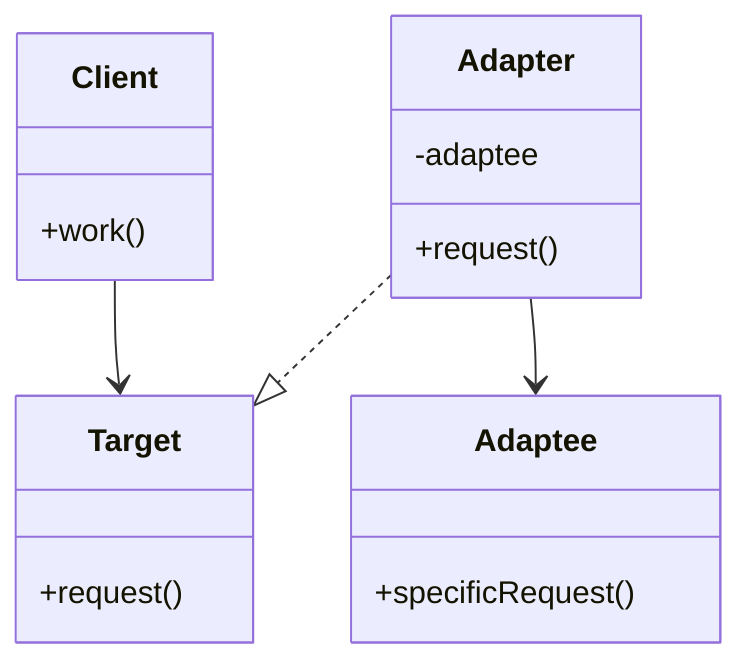
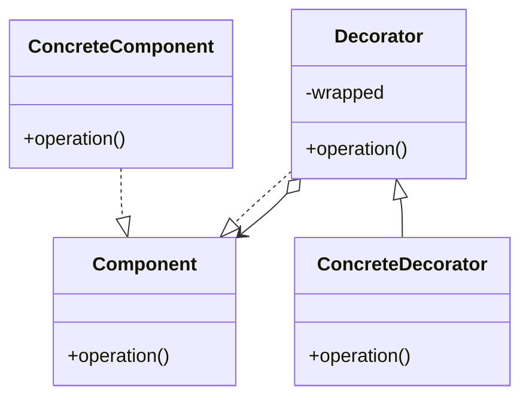
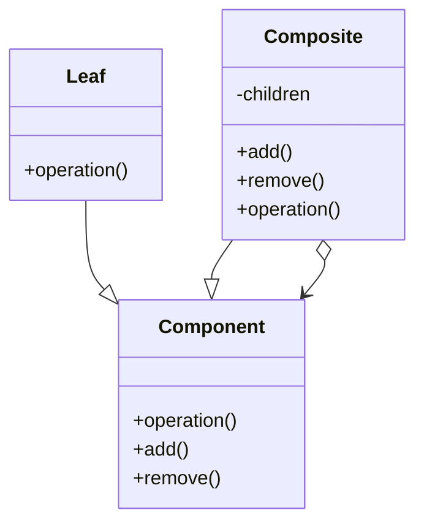
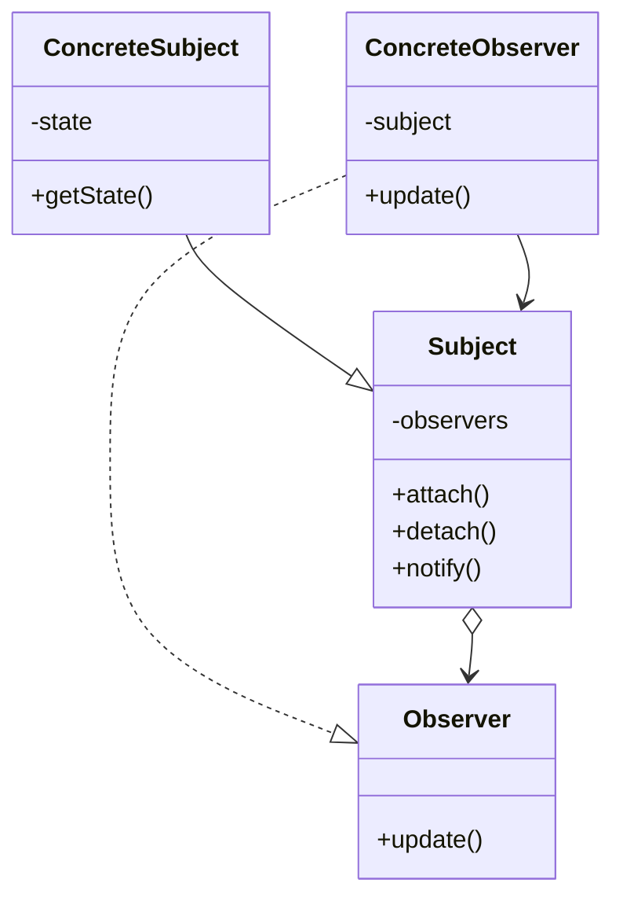

## 1. Lambda kalkul

Tato praktická otázka se objevuje téměř v každém termínu. Cílem je zjednodušit výraz pomocí $\beta$-redukce.

- **Varianta A:** $(\lambda ab.a(\lambda a.a)b)(\lambda ab.a)$. **Výsledek:** $\lambda ba.a$.
- **Varianta B:** $(\lambda uw.u(\lambda uw.w)w)(\lambda w.w)$. **Výsledek:** $\lambda ww.w$.
- **Varianta C:** $(\lambda za.z(\lambda a.a)a)(\lambda za.z)$. **Výsledek:** $\lambda aa.a$.

## 2. Robinsonův unifikační algoritmus a MGU

Hledání nejobecnějšího unifikátoru (MGU) pro zadané termy.

- **Teoretická část:** Popište vstupy (množina termů $\Delta$), výstupy (substituce $\mu$) a princip hledání nesouhlasných párů s kontrolou výskytu.
- **Praktická varianta 1:** Unifikujte $get(tmp(Y), sum(69, 42), Z)$ a $get(X, sum(Y, 42), high(X))$.
  - **Výsledek:** MGU je $[tmp(Y)/X] \circ [69/Y] \circ [high(tmp(69))/Z]$.
- **Praktická varianta 2:** Unifikujte $push(in(Z), min(U, 84), W)$ a $push(U, min(U, V), max(V, Y))$.
  - **Výsledek:** MGU je $[in(Z)/U] \circ [84/V] \circ [max(84, Y)/W]$.

## 3. Návrhový vzor Adaptér

Konverze rozhraní třídy na jiné, které klient očekává.

- **Řešení:** Adaptér implementuje rozhraní `Target` a vnitřně deleguje volání na objekt `Adaptee`, který má nekompatibilní rozhraní.
- **UML diagram:** Klient závisí na `Target`, `Adapter` realizuje `Target` a asociací deleguje na `Adaptee`.



- **Kód (pohled klienta):**

```java
interface Target { void request(); }

class Adaptee { void specificRequest() { /* … */ } }

class Adapter implements Target {
    private final Adaptee adaptee;
    Adapter(Adaptee a) { this.adaptee = a; }
    public void request() { adaptee.specificRequest(); }
}

class Client {
    void work(Target t) { t.request(); }
    void demo() {
        Target adapter = new Adapter(new Adaptee());
        work(adapter);
    }
}
```

## 4. Návrhový vzor Dekorátor

Dynamické přidávání funkčnosti objektu bez modifikace jeho třídy.

- **Řešení:** Dekorátor implementuje stejné rozhraní jako původní objekt a v metodách přidává vlastní logiku před nebo po volání původního objektu.
- **UML diagram:** `Decorator` drží odkaz na `Component` a předává volání dál. Konkrétní dekorátor rozšiřuje chování.



## 5. Návrhový vzor Skladba

Umožňuje pracovat s jednotlivými objekty i jejich skupinami jednotně pomocí stromové struktury.

- **Řešení:** Společné rozhraní `Component` mají list i složenina. `Composite` drží kolekci dětí a operace propaguje rekurzivně.
- **UML diagram:**



## 6. Návrhový vzor Pozorovatel

Definuje závislost 1:N mezi objekty, aby při změně stavu jednoho byly ostatní informovány.

- **Řešení:** `Subject` drží seznam `Observer` a při změně stavu volá `notify()`. Každý pozorovatel implementuje `update()`.
- **UML diagram:**



- **Kód (základní idea):**

```java
interface Observer { void update(); }

class ConcreteSubject {
    private final List<Observer> observers = new ArrayList<>();
    void attach(Observer o) { observers.add(o); }
    void setState(/* … */) { /* změna */ notifyAll(); }
    void notifyAll() { for (Observer o : observers) o.update(); }
}
```

## 7. Rozsah platnosti (Scope)

Definice a specifika v jazycích C a Python.

- **Řešení:** **Rozsah platnosti** je část programu, ve které je proměnná viditelná a lze s ní pracovat. V C je dán bloky a funkcemi, v Pythonu se rozlišuje lokální, globální a „nonlocal“ rozsah, přičemž dochází k zakrývání jmen (shadowing).

## 8. Uzavřený podprogram

Definice klíčového milníku v historii programování.

- **Řešení (4 odrážky):** 1. Má jednoznačné jméno. 2. Má definované parametry (typ, pořadí). 3. Může vracet výsledek. 4. Má vlastní lokální kontext (proměnné a kód).
- **Výsledek:** Umožnil rekurzi a ukrytí implementace.

## 9. Způsoby předávání parametrů

Strategie přijímání dat podprogramem.

- **Řešení:** **Hodnotou** (vytváří se kopie), **odkazem** (předává se adresa nebo ukazatel), **jménem** (předává se předpis nebo metoda, vyhodnocuje se při každém přístupu).

## 10. Paměťové uložení v C (2D pole struktur)

Výpočet adresy konkrétního prvku s ohledem na zarovnání (alignment).

- **Řešení:** Adresa prvku `a[i][j]` se vypočte jako: $Addr = A + (i \times sizeY + j) \times struct\_size + offset\_polozky$.
- **Důležité:** Je nutné započítat výplňkové bajty (**padding**) pro zarovnání na hranici slova (typicky 32 nebo 64 bitů).

## 11. Imperativní vs. deklarativní paradigma

Srovnání modelu výpočtu a přístupu programátora.

- **Řešení:** Imperativní jazyky řeší **„jak“** (sekvence příkazů měnících vnitřní stav). Deklarativní řeší **„co“** (vlastnosti výsledku), vnitřní stav je skrytý a opakování se řeší **rekurzí** místo cyklů.

## 12. Obsah třídy a instance v čistém OO modelu

Co přesně tvoří tyto entity v paměti.

- **Řešení:** **Třída** obsahuje metadata atributů, data statických atributů, kód instančních metod a odkaz na svou třídu (metatřídu). **Instance** obsahuje identitu, odkaz na svou třídu a konkrétní data instančních atributů.

## 13. Vícenásobná dědičnost a diamantový problém

Problémy spojené s více přímými předky.

- **Řešení:** Kolize jmen (stejná jména metod nebo atributů), pořadí volání konstruktorů a **diamantová struktura**, která způsobuje duplikaci atributů společného předka v paměti.

## 14. Beztřídní jazyky a SELF

Principy prototypů a delegace.

- **Řešení:** Objekty se skládají ze **slotů** (datové, metodové, rodičovské). Nové objekty vznikají **klonováním**. Pokud objekt zprávě nerozumí, přepošle ji rodiči přes **rodičovský slot** (delegace).

## 15. Sémantika a dynamické chyby v C

Definice významu a chyby zjistitelné až za běhu.

- **Řešení:** **Sémantika** definuje význam syntakticky správných programů. **Dynamické chyby:** dělení nulou po vstupu uživatele, přístup mimo rozsah pole, práce s neplatným ukazatelem (dangling pointer), přetečení (overflow).

## 16. Bitová pole a Assembler

Nízkoúrovňový přístup k položce v bitovém poli.

- **Řešení:** Pro přístup k bitům je nutné: 1. Načíst slovo z paměti. 2. Provést **bitový posun** (shift). 3. Aplikovat **bitovou masku** (AND) k vyfiltrování cílových bitů.

## 17. Perzistentní vs. tranzientní objekty

Doba života objektů vzhledem k běhu aplikace.

- **Řešení:** **Perzistentní** objekt přežívá ukončení aplikace a po restartu má stejný stav i identitu. Deklaruje se slovem **`persistent`**. **Tranzientní** zaniká nejpozději s ukončením programu.

## 18. SLD rezoluce

Vyhodnocovací strategie v jazyce Prolog.

- **Řešení:** Prohledávání do hloubky, výběr klauzulí shora dolů a vyhodnocování těla zleva doprava.
