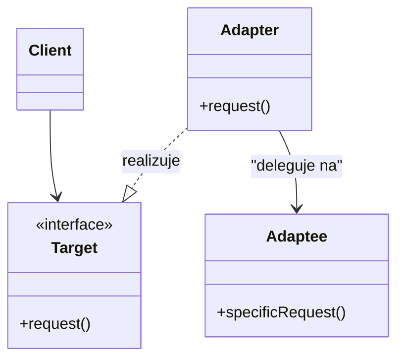
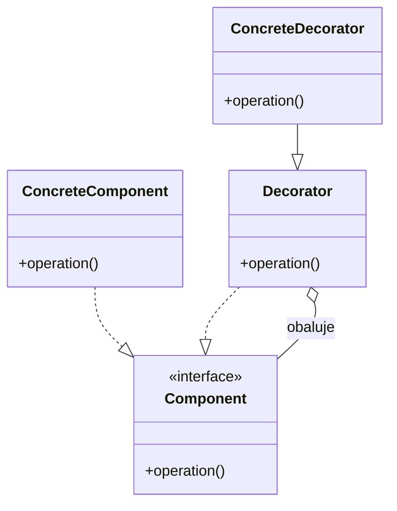
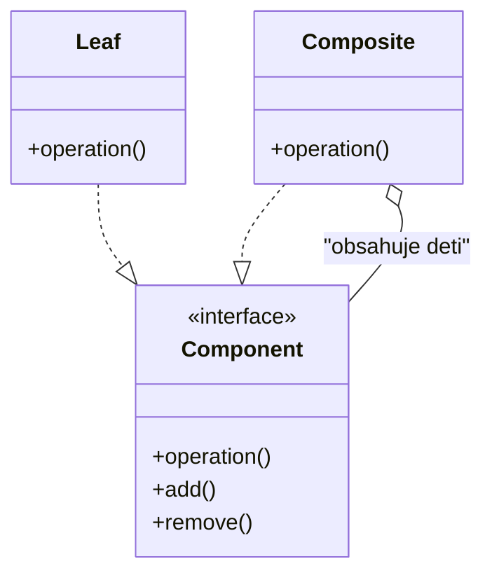
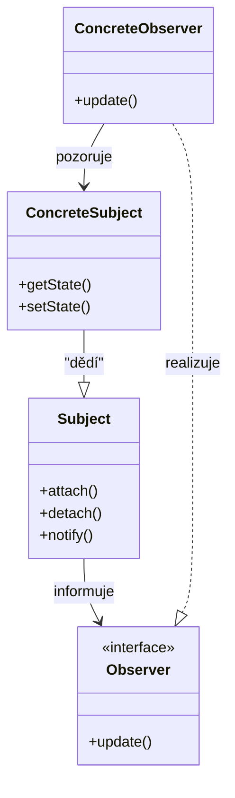

## 1. Proveďte a demonstrujte po krocích potřebné $\alpha$-, $\beta$-konverze tak, aby zadaný $\lambda$-výraz neobsahoval $\beta$-redex.

**Příklad demonstrace:** $(\lambda uw.u(\lambda uw.w)w)(\lambda w.w)$
    1. **$\beta$-redukce:** $(\lambda w.(\lambda w.w)(\lambda uw.w)w)$ kde $[(\lambda w.w)/u]$.
    2. **$\beta$-redukce:** $(\lambda w.(\lambda uw.w)w)$ kde $[(\lambda uw.w)/w]$.
    3. **$\beta$-redukce:** $(\lambda w.(\lambda w.w))$ kde $[w/u]$.
    4. **Výsledný term:** $\lambda ww.w$.

- **Varianta A:** $(\lambda ab.a(\lambda a.a)b)(\lambda ab.a)$. **Výsledek:** $\lambda ba.a$.
- **Varianta B:** $(\lambda uw.u(\lambda uw.w)w)(\lambda w.w)$. **Výsledek:** $\lambda ww.w$.
- **Varianta C:** $(\lambda za.z(\lambda a.a)a)(\lambda za.z)$. **Výsledek:** $\lambda aa.a$.

## 2. Pro níže uvedené dvojice termů uveďte nejobecnější unifikátor (MGU) ke každé dvojici a term vzniklý aplikací tohoto nejobecnějšího unifikátoru.

**Příklad provedení:** Unifikujte $get(tmp(Y), sum(69, 42), Z)$ a $get(X, sum(Y, 42), high(X))$
1. **1. nesouhlasný pár:** $tmp(Y)$ a $X \rightarrow$ substituce $[tmp(Y)/X]$.
2. **2. nesouhlasný pár:** $69$ a $Y \rightarrow$ substituce $[69/Y]$.
3. **3. nesouhlasný pár:** $Z$ a $high(tmp(69)) \rightarrow$ substituce $[high(tmp(69))/Z]$.

**Výsledný MGU ($\mu$):** $[tmp(Y)/X] \circ [69/Y] \circ [high(tmp(69))/Z]$.
   **Term vzniklý aplikací:** $get(tmp(69), sum(69, 42), high(tmp(69)))$.

- **Praktická varianta 1:** Unifikujte $get(tmp(Y), sum(69, 42), Z)$ a $get(X, sum(Y, 42), high(X))$.
  - **Výsledek:** MGU je $[tmp(Y)/X] \circ [69/Y] \circ [high(tmp(69))/Z]$.
- **Praktická varianta 2:** Unifikujte $push(in(Z), min(U, 84), W)$ a $push(U, min(U, V), max(V, Y))$.
  - **Výsledek:** MGU je $[in(Z)/U] \circ [84/V] \circ [max(84, Y)/W]$.

## 3. Stručně a výstižně definujte SLD rezoluci a popište její strategii vyhodnocování v Prologu.

**Přesné schéma vyhodnocení:**
    1. Klauzule jsou z databáze vybírány postupně **shora dolů**.
    2. Těla predikátu jsou vyhodnocována **zleva doprava**.
    3. Jedná se o **prohledávání do hloubky (DFS)**. Dokud neuspěje první podcíl, ostatní zůstávají nedotčené.
    4. Při selhání dochází k mechanismu **zpětného navracení (backtracking)** k předchozímu bodu volby.

## 4. Návrhový vzor Adaptér

Konverze rozhraní třídy na jiné, které klient očekává.

- **Řešení:** Adaptér implementuje rozhraní `Target` a vnitřně deleguje volání na objekt `Adaptee`, který má nekompatibilní rozhraní.
- **UML diagram:** Klient závisí na `Target`, `Adapter` realizuje `Target` a asociací deleguje na `Adaptee`.

## 5. Návrhový vzor Dekorátor

Dynamické přidávání funkčnosti objektu bez modifikace jeho třídy.

- **Řešení:** Dekorátor implementuje stejné rozhraní jako původní objekt a v metodách přidává vlastní logiku před nebo po volání původního objektu.
- **UML diagram:** `Decorator` drží odkaz na `Component` a předává volání dál. Konkrétní dekorátor rozšiřuje chování.

## 6. Návrhový vzor Skladba

Umožňuje pracovat s jednotlivými objekty i jejich skupinami jednotně pomocí stromové struktury.

- **Řešení:** Společné rozhraní `Component` mají list i složenina. `Composite` drží kolekci dětí a operace propaguje rekurzivně.
- **UML diagram:**

## 7. Návrhový vzor Pozorovatel

Definuje závislost 1:N mezi objekty, aby při změně stavu jednoho byly ostatní informovány.

- **Řešení:** `Subject` drží seznam `Observer` a při změně stavu volá `notify()`. Každý pozorovatel implementuje `update()`.
- **UML diagram:**

## 8. Detailně vysvětlete pojem rozsah platnosti proměnné (scope). Uvažte jazyk C a jazyk Python — pro každý jazyk popište, co je pro něj typické stran tohoto pojmu

**Rozsah platnosti proměnné (scope)** určuje tu část programu (textu), ve které je identifikátor proměnné viditelný a lze s ním pracovat (přistupovat k entitě).

- **Jazyk C (typické vlastnosti):** Pro jazyk C je typická **statická vazba** rozsahu platnosti, která je dána strukturou bloků a funkcí ve zdrojovém textu; v rámci zanořených bloků může lokální proměnná zakrýt (shadowing) globální proměnnou stejného jména.

- **Jazyk Python (typické vlastnosti):** V Pythonu je rozsah platnosti určen jmennými prostory a pravidlem vyhledávání **LEGB** (Local, Enclosing, Global, Built-in), přičemž první přiřazení do proměnné v těle funkce ji automaticky definuje jako lokální, pokud není explicitně použito klíčové slovo global nebo nonlocal.

## 9. Přesně definujte klíčové vlastnosti, kterými lze charakterizovat uzavřený podprogram (4 odrážky) a uveďte, co jeho vznik umožnil.

**Klíčové vlastnosti:**
    1.  Má **jméno**, které ho jednoznačně identifikuje.
    2.  Má **parametry**, které mají uvnitř své jméno, často mají definovaný typ a jsou dány pevným pořadím.
    3.  Může mít **výsledek**.
    4.  Má **vlastní kód**, který obsahuje lokální proměnné.

**Význam vzniku:** Umožnil přímočarou implementaci **rekurze**, **ukrytí implementace** a **odluku od hlavního toku** programu, což vede k bezpečnější modifikaci.

## 10. Uveďte a do podrobna rozveďte typy předávání parametrů u strukturovaných imperativních jazyků.

**Způsoby předávání:**
    1.  **Hodnotou (Call-by-value):** Při tomto způsobu se vytváří lokální kopie dat - parametry jsou vyčísleny před voláním podprogramu.
    2.  **Odkazem (Call-by-reference):** Podprogramu se předává ukazatel (adresa) na danou proměnnou - změny provedené uvnitř se okamžitě a přímo projevují navenek v původní entitě.
    3.  **Jménem (Call-by-name):** Podprogramu se předává dvojice přístupových metod k dané entitě pro zápis a čtení její hodnoty - výraz se vyhodnocuje při každém přístupu k parametru.

## 11. Vytvořte generický výraz pro určení adresy položky na pozici a[i][j]. Jak by se výraz změnil, kdyby byly zapnuty modifikátory pro těsné uložení struktury?

**Základní vzorec:** $Addr = A + (i \times sizeY + j) \times struct\_size + offset\_polozky$.
**Zarovnání (Alignment):** Jednotlivé položky jsou v paměti zarovnané na délku slova, což vytváří výplňkové bajty (**padding**).
**Těsné uložení (Packed):** Pokud jsou zapnuty modifikátory pro těsné uložení, výplňkové bajty jsou odstraněny a `struct_size` se zmenší na přesný součet velikostí jednotlivých typů.

## 12. Popište rozdíl v modelu výpočtu deklarativních a imperativních jazyků, v čem se liší a jak se v nich řeší opakování?

- **Imperativní paradigma:** Programátor řeší otázky **co** za operace má být provedeno a **v jakém pořadí (jak)** to má být provedeno; zpracování probíhá jako postupná modifikace vnitřního stavu a opakování se řeší **cykly**.

- **Deklarativní paradigma:** Programátor řeší pouze otázku **co** má být zpracováno; interní stav a pořadí vyhodnocení je určeno strategií překladače a neznají sekvence ani cykly, takže opakování je řešeno výhradně **rekurzí**.

## 13. Co obsahuje třída a co instance v čistě třídně zaměřených objektových jazycích (4 + 2 odrážky)?

**Třída obsahuje:**
1. Seznam (metadata) instančních atributů.
2. Data třídních (statických) atributů.
3. Implementace metod (instančních i třídních).
4. Referenci na její vlastní třídu (metatřídu).

**Instance obsahuje:**
1. Vlastní identitu.
2. Referenci na její třídu.
3. Konkrétní data instančních atributů.

## 14. Co je to vícenásobná dědičnost (1 věta) a jaké 3 (případně 4) problémy mohou nastat při jejím využití? (Uveďte popis a důvody)

**Definice:** Vícenásobná (třídní) dědičnost nastává, když má nově definovaná třída více než jednu přímou nadtřídu.

**Problémy (včetně důvodů):**
1. **Kolize jmen (atributů a metod):** Nastává, když přímé nadtřídy obsahují členy stejného jména a typu. **Důvod:** Návrhář jazyka musí rozhodnout o pravidlech vyhledávání konkrétní implementace při invokaci (např. priorita pořadí zápisu nebo povinná redefinice).

2. **Pořadí inicializace (konstruktory):** Je nutné stanovit pořadí volání konstruktorů všech nadtříd. **Důvod:** Při implicitním volání se využívá algoritmus prohledávání grafu dědičnosti do hloubky (DFS), aby se předešlo duplicitní inicializaci.
3. **Uložení instance v paměti:** Není univerzální řešení, jak efektivně uspořádat data atributů. **Důvod:** Je obtížné zajistit, aby bylo možné instanci využít kdekoli, kde je očekáván objekt kterékoli z nadtříd (problém subsumpce).

## 15. Popište, co v hierarchii třídní dědičnosti znamená **diamantová** struktura a jaký implementační problém přináší z hlediska uložení instance v paměti.

**Popis situace:** Vzniká, když dvě nadtřídy (B a C) dědí od stejného společného předka (A) a nová podtřída (D) dědí z obou těchto nadtříd (B i C).

**Implementační problém:** Hlavním problémem je **rozložení instance v paměti**, protože instanční atributy společného předka (A) by mohly být v paměti instance koncového potomka (D) uloženy **dvakrát** (jednou přes cestu B a podruhé přes C).

**Důsledek a řešení:** Pokud se data duplikují, vzniká problém s udržením hodnotové konzistence - řešením je v některých jazycích (např. C++) **virtuální dědičnost**, která zajistí, že společný předek je v instanci přítomen pouze jednou.

## 16. Popište objekt v jazyce **SELF**, co je to **dynamická dědičnost** a co je to **aktivační objekt** (třída)?“

**Objekt v SELF:** Je to seznam položek nazývaných **sloty**.
**Dynamická dědičnost:** Schopnost objektu měnit své rodiče za **běhu programu**.
**Aktivační objekt:** Vzniká při invokaci metody jako **klon objektu metody**. Slouží jako lokální jmenný prostor a zaniká po dokončení výpočtu.

## 17. Co je to **slot** v beztřídním OOJ (jedna věta) a jaké **typy slotů** existují (3 odrážky)?

**Slot:** Je to dvojice skládající se z unikátního **jména** a **odkazu** na jiný objekt.

- **Datový slot:** Odkazuje na objekt reprezentující data.
- **Metodový slot:** Odkazuje na objekt obsahující kód metody.
- **Rodičovský slot (Parent):** Obsahuje odkaz na objekt, na který se delegují zprávy, jimž aktuální objekt nerozumí.

## 18. OOJ SELF: Jak se vytvářejí objekty, kdo všechno se toho účastní, co se od koho bere a jak se tyto složky volají?

**Klonování:** Nové objekty vznikají **mělkou kopií** (klonováním) existujícího objektu.

**Účastníci a co poskytují:**
- **Prototyp:** Objekt, který je klonován poskytuje novému objektu jeho základní strukturu, tedy datové sloty s implicitními hodnotami.
- **Rys (Traits):** Speciální objekt, který obsahuje pouze sdílené metody a rodičovské sloty - prototyp na něj odkazuje, čímž se sdílí implementace metod napříč všemi klony.

**Jak se volají:**
- K datovým slotům se přistupuje zasláním zprávy s jejich jménem.
- Pokud objekt obdrží zprávu, pro kterou nemá slot, provede se **delegace**: zpráva se přepošle rodiči přes rodičovský slot, přičemž se **nemění kontext**.

## 19. Uveďte 4 různé sémantické chyby teoreticky zjistitelné dynamicky (během běhu) v jazyku C.

**Přesné vypracování:**
1.  **Dělení nulou** po uživatelském vstupu.
2.  **Indexování mimo rozsah pole** .
3.  **Špatná práce s pamětí / Neplatný ukazatel** (např. dereference NULL nebo práce s „dangling pointerem“).
4.  **Aritmetické přetečení nebo podtečení (overflow/underflow)**.

## 20. Co je to sémantika? Jaké způsoby (formalismy) se používají při její definici (4 odrážky)?

 **Definice:** Sémantika je popis nebo definice **významu** jednotlivých syntaktických konstrukcí a způsobu jejich vyhodnocování a zpracování.

**Způsoby definice (formalismy):**
1. **Axiomatická sémantika:** Pro každou syntaktickou konstrukci definuje množinu axiomů, které musí být splněny, aby byla konstrukce platná.
2. **Operační sémantika:** Definuje chování programu jako posloupnost přechodů mezi danými stavy stroje.
3. **Denotační sémantika:** Program je definován jako matematická funkce, která mapuje vstupy na výstupy.
4.  **Slovní popis / Ukázka na příkladech:** Neformální vysvětlení chování.

## 21. Popište sémantiku přístupu k položce v bitovém poli na úrovni instrukcí procesoru (ASM kroky).

**Sémantické kroky:**
1. **Načtení:** Načíst celé slovo z paměti.
2. **Posun:** Provést instrukci pro **bitový posun nebo rotaci** (shift/rotate), aby cílové bity byly zarovnány na začátek (nebo konec) registru.
3. **Maskování:** Aplikovat operaci pro **bitové maskování** (typicky instrukce AND) k odfiltrování ostatních nežádoucích bitů ve slově.

## 22. Definujte perzistentní a tranzientní objekt a uveďte klíčové slovo pro perzistenci.

**Perzistentní objekt:** Přežívá dobu běhu aplikace a po restartu systému je opět k dispozici se stejným stavem i identitou, v jaké byl při posledním ukončení.
**Tranzientní objekt:** Vzniká dynamicky za běhu programu a zaniká nejpozději s jeho ukončením.
**Klíčové slovo:** V deklarativním označení se pro perzistenci používá slovo **`persistent`**.

## 23. Definujte co je Hornova klauzule, zapište ji jak v Prologu, tak v predikátové logice.

**Definice:** Hornova klauzule je speciální typ logické klauzule, která obsahuje **nejvýše jeden** pozitivní literál.
*   **Zápis v Prologu:** `H :- B1, B2, ..., Bn.` kde $H$ je hlava a $Bi$ jsou podcíle v těle.
*   **Zápis v predikátové logice:** $H \lor \neg B_1 \lor \neg B_2 \lor ... \lor \neg B_n$ což je ekvivalentní implikaci $B_1 \land B_2 \land ... \land B_n \implies H$.

## 24. Co je to polymorfismus a může se využít i u objektových jazyků, které nevyužívají dědičnost? Pokud ano, uveďte příklady jak a uveďte příklad konkrétního jazyka.

**Definice:** Polymorfismus je schopnost, kdy stejnou zprávu lze zaslat různým objektům, přičemž protokol příjemce umožňuje individuální reakci (invokaci různých metod), protože odesílatel nezná konkrétní implementaci.

**Polymorfismus bez dědičnosti:** Ano, je možný. Využívá se u beztřídních jazyků nebo u jazyků s **Duck Typingem**, kde je důležité rozhraní (seznam zpráv, kterým objekt rozumí), nikoliv jeho typ či umístění v hierarchii.
*   **Příklady:** Jazyk **SELF** (založený na prototypech) nebo **Python** (dynamické typování).