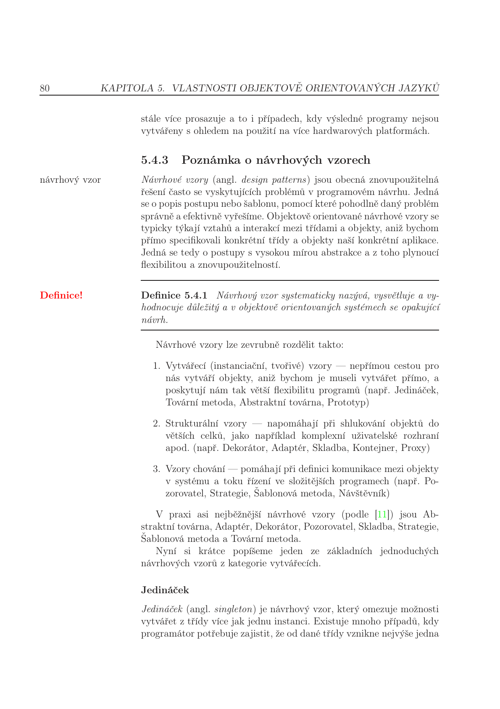

## 24-25

### 1.termín

1. **Detailně vysvětlete pojem rozsah platnosti proměnné (scope). (1 souvětí) Uvažte jazyk C a jazyk Python — pro každý jazyk popište jak to je s rozsahem platnosti proměnných, co je pro každý z jazyků typické stran tohoto pojmu. (stačí 2 souvětí, pro každý jazyk jedno, ale výstižně)**
   - Rozsah platnosti proměnné určuje tu část programu, kdy je možné s ní pracovat.
   - C = lokální, globální, třídní, jmenný prostor, funkční
   - Python = pravidlo **LEGB**: Local (uvnitř funkce) → Enclosing (vnější funkce) → Global (modul) → Built-in
(vestavěné).

2. **Popište rozdíl mezi statickou a třídní metodou v třídním objektově orientovaném jazyce (OOJ). Jaké je u nich omezení při použití instančních atributů a proč? (2 souvětí)**
**Statická**: BEZ self-parametru – funkce ve jmenném prostoru třídy, nemůže přistupovat k inst. ani třídním
proměnným přes self.
**Třídní:** self = objekt třídy – může přistupovat k třídním proměnným. Obě nemohou
přistupovat k instančním atributům.

3. **Mějme třídní OOJ s podporou výjimek, kde třída výjimky ExA má přímou podtřídu ExB a od ExB přímo dědí ExC. V hlavním těle programu mějme trojici bloků try-catch-finally (nazvěme je vnější) následovanou zbylým kódem, tzv. vnější epilog. Vnější catch-blok má formální parametr typu ExA. Uvnitř vnějšího try-bloku je trojice bloků try-catch-finally (nazvěme je vnitřní) a zbytek kódu vnějšího try-bloku označme jako vnitřní epilog. Vnitřní catch-blok má formální parametr typu ExC. Uvažujme, že na začátku vnitřního try-bloku dojde k vyvolání výjimky třídy ExB. Popište průběh ošetření výjimky v hlavním těle programu (až po případný návrat ke standardnímu modelu výpočtu), aby bylo jasné, které části kódu se vykonají a které ne a proč. (cca 4 souvětí)**

   - Po vyvolání výjimky ve `try` proběhne skok na příslušný `catch` a na jeho formální parametr se naváže objekt výjimky. `finally` je deklarativně označená sekce, která se **nepřeskočí** ani při výjimce.
   - Vnitřní `catch (ExC)` výjimku `ExB` **nezachytí**: handler pro typ `ExC` přijímá jen `ExC` a podtřídy, `ExB` je v hierarchii **nad** `ExC`, není jí podřízená.
   - Tělo vnitřního `catch` se tedy neprovede. **Vnitřní `finally` se provede vždy.** Vnitřní epilog vnějšího `try` se neprovede (výjimka „probublá“ ven).
   - Vnější `catch (ExA)` už `ExB` zachytí (`ExB` ⊆ `ExA`), na parametr se naváže objekt výjimky. Pak následuje **vnější `finally`** a nakonec při absenci dalšího šíření výjimky **vnější epilog** — návrat k obvyklému sekvenčnímu výpočtu.

4. **Pomocí UML diagramu tříd navrhněte implementaci návrhového vzoru Pozorovatel (angl. Observer) pro staticky typovaný třídní OOJ s podporou abstraktních tříd. Variantu si vyberte dle libosti, ale uveďte kterou. U důležitých metod uveďte jejich pseudokód. Několika řádky kódu demonstrujte typické použití (instanciaci, provázání a použití) tohoto vzoru s využitím entit uvedených v UML diagramu. (UML diagram, ukázka kódu)**

   - **Zvolená varianta**: tzv. „pull“ model — subjekt drží kolekci pozorovatelů a při změně stavu je **notify()** volá jednou metodou nad všemi registrovanými instancemi (`attach` / `detach`).
   - **UML (myšlenkově)**:
     - Abstraktní `Subject` + konkrétní subjekt (např. `ConcreteSubject`) s metodami `attach(Observer o)`, `detach(Observer o)`, `notify()` a čtením stavu.
     - Rozhraní nebo abstraktní `Observer` s `update()` + konkrétní pozorovatelé přepisují `update()` (volitelně čtou stav u subjektu).
   - Ilustrace řazení vzorů chování v přehledové tabulce:



   - **Pseudokód**

```
notify():
    pro každé o v observers:
        o.update()

ConcreteSubject.setState(x):
    this.state = x
    this.notify()
```

   - **Ukázka použití (idea kódu)**

```
ConcreteSubject s = new ConcreteSubject()
ConcreteObserver o1 = new ConcreteObserver(s)
s.attach(o1)
s.setState(42)   // zajistí notify → o1.update()
```

6. **Definujte pojem typové proměnné známé nejen z funkcionálních jazyků. Vysvětlete (stručně, ale přesně): co to je, k čemu to je/co to umožňuje, ukažte obecný příklad využití, jaká je obdoba v jazycích jako C++, Java, C#?**

   - **Co je typová proměnná**: symbol v **schématu typu** (např. „α je typ řady“, „t je elementární typ“), který při kontrole nebo odvození typu reprezentuje **neznámý konkrétní typ** a nahradí se konkrétním typem při **instanciaci** nebo unifikaci odvození.
   - **K čemu slouží**: jedna funkce nebo datová struktura může být správně typována pro **mnoho typů** bez kopírování kódu pro každý typ zvlášť (parametrický polymorfismus).
   - **Příklad**: funkce `length :: [a] -> Int` vrací délku seznamu bez závislosti na tom, zda jde o `[Int]` nebo `[Char]`.
   - **Obdoba v C++ / Java / C#**: **šablony** (`template<typename T> …`) v C++, **generika** (`List<T>`, `<T>` u rozhraní/tříd) v Javě a C#. **Typové třídy** (např. v Haskellu nebo Goferu) omezují, jaké operace musí typ `T` mít — jde o nadstavbu nad holou typovou proměnnou.

7. **Stručně a výstižně definujte výčtem, co musí splňovat výstup kompilátoru modulárních programovacích jazyků, aby výsledný kód byl po „slinkování“ funkční — pozor, nemyslí se chyby v algoritmu, návrhu, implementaci, nebo v době linkování, ale vlastnosti kódu generovaného překladačem nutné pro správné propojení modulů. (Obecná věta plus cca 4-8 odrážky (dle detailu dělení). Všechny zkratky je nutné beze zbytku vysvětlit, ne jen rozvést, a přesně specifikovat jejich význam. Ne jen náznakem, nebo příkladem. Plně!)**

   - **Obecná věta**: překladač každého modulu musí vygenerovat **relativní objektový kód** (adresy uvnitř modulu často nejsou konečné) a současně dostatečnou **symbolickou informaci**, aby je **spojovací program** (*linker*) mohl sloučit moduly do jednoho spustitelného celku.
   - **Tabulky symbolů / export–import**: u každého modulu musí být jasné, které symboly (funkce, proměnné, typy dle jazyka) jsou **definovány v tomto modulu**, které jsou jen **deklarovány jako závislost z jiného modulu** (*extern*, hlavička), a které **vyváží** (*export*) pro ostatní. Linker páruje **požadované** symboly s **nabízenými**.
   - **Relokace**: ve výstupu musí být zaznamenány **odkazy** (relokační záznamy) na místa v kódu nebo datové sekci, kde dosud není **absolutní adresa**, nýbrž odkaz přes tabulku symbolů nebo offset vůči začátku sekce. Až linker známými adresami sekce a symbolů tyto hodnoty **dopočítá** (*relokovat*).
   - **Volání mezi moduly**: volání funkce nebo přístup k proměnné v jiném modulu nesmí být v objektovém souboru vygenerováno jako finální absolutní skok bez možnosti doplnění. Typicky jde o **zástupný odkaz**, který linker nahradí správnou adresou po sloučení.
   - **Konzistence typů a jednoznačnosti**: překladač musí do výstupu zapsat symbol tak, aby linker mohl odhalit **chybějící definici**, **vícenásobnou definici** nebo **konflikt typů** stejného jména mezi moduly (pokud jazyk a nástroje takovou kontrolu vůbec umožňují).
   - **Formát objektového souboru** (např. ELF na unixových systémech): jednotný způsob uložení **strojového kódu**, **dat**, **tabulek symbolů** a **relokačních informací**, aby je linker uměl číst napříč moduly i překladači.

8. **Přesně definujte klíčové vlastnosti/jak lze charakterizovat uzavřený podprogram. (4 odrážky)**

   - **Rozhraní**: má **jméno**, **formální parametry** a **návratový typ** (nebo ekvivalent v daném jazyce). Volající ví, jak podprogram volat a co očekávat.
   - **Lokální rámec**: má **lokální proměnné** a pracuje se **zásobníkem** (aktivační záznam), takže nezávisí na „náhodných“ globálních úložištích jako holý skok.
   - **Vstup a výstup**: řízení se předává **voláním** (s argumenty) a vrací se **návratem** s výsledkem. Není to vstup skokem bez struktury parametrů jako u otevřeného podprogramu.
   - **Rekurze a vnořování**: díky rozhraní a lokálním proměnným lze podprogramy **vnořovat** a používat **rekurzi**. U otevřeného podprogramu typicky chybí lokální rámec vhodný pro čistou rekurzi.

9. **Proveďte a demonstrujte po krocích potřebné α-, β-konverze tak, aby zadaný λ-výraz neobsahoval β-redex. (λxz.xz(λz.z))(λxz.z)**

   - **α** (oddělení vnitřního `z` od vnější abstrakce): `(λxz.xz(λz.z))(λxz.z)` ≡ `(λxz.xz(λw.w))(λxz.z)`.
   - **β** (aplikace levé abstrakce na pravý operand `G = λxz.z`): výsledek je `λz. ((λxz.z) z) (λw.w)`. První aplikace `(λxz.z) z`: přejmenujeme `λxz.z` na `λxλz'.z'` a substituujeme `x := z`, dostaneme `λz'.z'`.
   - **β** dál: `(λz'.z')(λw.w)` →β `λw.w`. Celkově **λz. λw.w**.
   - Žádný podvýraz tvaru aplikace `(λ… …) …` už není — výraz je v **normální formě** (až na α ekvivalenci např. `λa.λb.b`).

10. **Prémie: Máme-li dvoudimenzionální pole v jazyce C (bez modifikátorů, tedy se zarovnaným uložením), velikost dimenzí nechť je po řadě sizeX a sizeY — tedy a[sizeX][sizeY]. Prvkem pole je struktura s následujícími členy, po řadě: celé číslo, ukazatel, celé číslo, ukazatel, desetinné číslo, znak. Velikosti jsou: celé číslo 4 bajty (32 bitů), ukazatel 4 bajty, znak 1 bajt (8 bitů), desetinné číslo 8 bajtů (64 bitů). Vytvořte generický výraz pro určení adresy znaku na pozici a[i][j], když pole je umístěno od adresy A a architektura je 32bitová. Jak by se výraz změnil, kdyby byly zapnuty modifikátory pro těsné uložení struktury? Nejde o postup výpočtu, jde o jeden generický aritmetický výraz, do kterého když dosadíme konkrétní hodnoty pro dané konstanty a proměnné, tak dostaneme adresu v paměti.**

   - **Zarovnaná struktura**: offset znaku od začátku struktury je **24** (čtyři × 4 B + 8 B double + bez mezery před znakem). Po znaku často **výplň** až na násobek největšího zarovnání typu v struktuře → velikost struktury **sizeof(S) = 32** B (typické pro `double` zarovnaný na 8).
   - **Adresa znaku v `a[i][j]`** (řádkové uložení pole): **`A + (i · sizeY + j) · sizeof(S) + 24`**.
   - **Těsné uložení** (např. `#pragma pack(1)`): žádné mezipaddingy mezi členy, **`sizeof(S) = 4+4+4+4+8+1 = 25`**, offset znaku stále **24**.
   - **Adresa znaku při těsném uložení**: **`A + (i · sizeY + j) · 25 + 24`**.

### 2. termín

1. **Sémantika**
   - **Sémantika** je **popis významu** syntaktických konstrukcí a **způsobu jejich vyhodnocení a zpracování**.
   - Zhruba **čtyři způsoby zápisu**: **axiomatická** (axiomy u syntaktických konstrukcí), **operační** (**přechody mezi stavy**), **denotační** (**program jako matematická funkce** vstupů na výstupy), **neformální** (**slovní popis** a **příklady**).
   - Dále **statická sémantika** (vlastnosti ověřitelné při **překladu** — typy, deklarace, viditelnost) versus **dynamická sémantika** (až **za běhu** — např. index pole z výrazu, platnost dereference ukazatele u C).

2. **Aké položky obsahuje trieda (v Pythone)**
   - Instance má **`__class__`** (odkaz na třídu) a **`__dict__`** s **instančními atributy**. **Metody v `__dict__` instance obvykle nejsou** — dohledávají se **přes třídu** a MRO.
   - **Objekt třídy** je instance metatřídy `type` a má mimo jiné **`__bases__`**, **`__dict__`** kde jsou **metody** a **atributy třídy** (např. u třídy `Circle` může být v `__dict__` třídní konstanta `pi`).

3. **Try-catch-finally**
   - **`try`**: chráněný blok kde může vzniknout výjimka. **`catch` / `except`**: výběr handleru podle **typu** výjimky (často i podtřídy). **`finally`**: proběhne při opuštění bloku `try` touto cestou **vždy** i když výjimku daný `catch` **nezachytí** a probublá výš.
   - Při probublávání se dokončují **`finally`** vnitřních bloků po řadě od nejvíc vnitřního ven. V češtině často **zkusit / kromě / nakonec** (Java), v Pythonu **`try` / `except` / `finally`**.

4. **NV Decorator**
   - **Dekorátor** je řazen mezi **strukturální** návrhové vzory (skládání tříd a objektů). Objektům **dynamicky přidává nové chování**, aniž by měnil jejich třídu, typicky **obalení** komponenty dekorátorem se **stejným rozhraním**.
   - Konkrétní dekorátor drží odkaz na **vnitřní** komponentu, deleguje na ni volání a přidává vlastní krok (logování, měření).
   - V Pythonu zápis **`@dekorátor`** jen zapisuje funkci vyššího řádu, která obalí původní funkci nebo metodu.

5. **Robinson (napísať algoritmus)**
   - **Robinsonův algoritmus** hledá **nejobecnější unifikátor** dvou termů prvního řádu nebo konstatuje že unifikace **nejde**.
   - Jsou-li oba termy **stejná proměnná** → úspěch prázdná substituce.
   - Je-li jeden term **proměnná** `x` a druhý term `t` postupuj podle **testu výskytu** (*occurs check*). Pokud se `x` **nevyskytuje** v `t` přidej substituci `x := t` jinak **selhání**.
   - Jsou-li oba **konstanty** jednobuché symboly → úspěch jen při **stejném** symbolu.
   - Jsou-li **složené** stejný **funktor** a **arita** jinak selhání jinak **rekurzivně** unifikuj argumenty po párech a **skládej** substituce (aplikuj už vzniklé substituce na další termy).

6. **Strict evaluation**
   - U strategie **volání hodnotou** se **parametry vyhodnocují před vstupem** do podprogramu. Pokud překladač navíc **nerozhoduje stejný podvýraz zbytečně víckrát** při více výskytech, říká se že vyhodnocení je **striktní**.
   - **Volání jménem** předává parametry **nevyhodnocené** jako **zástupné jméno** vyhodnocení až při použití ve volaném → strategie je **nestriktní**.
   - **Volání v případě potřeby** (*call-by-need* / lazy) doručí hodnotu až když ji tělo potřebuje **uschová ji** pro další použití → také **nestriktní**.

7. **Tri typy predávania parametrov v štrukturálnych jazykoch**
   - **Hodnotou** — předává se **kopie** dat do prostředí volaného. U primitiv změna neovlivní volajícího, u ukazatelů se kopíruje často **adresa**.
   - **Odkazem** — předává se **ukazatel** na proměnnou volajícího, alias na stejné úložiště (některé jazyky používají i **implicitní předávání odkazem** u velkých struktur).
   - **Jménem** — parametr zůstává **nevyhodnocený**, reprezentovaný **zástupným jménem**, dokud ho tělo nepotřebuje, klasicky Algol 60.
   - U **modulárních** jazyků se navíc rozlišuje předávání s **výsledkem** nebo kombinace hodnota–výsledek (**kopie zpět**) vedle těchto tří základních způsobů.

8. **Konvencia u modulárnych jazykov (riadenie toku)**
   - Moduly komunikují přes **rozhraní** v hlavičkách a direktivách **import** / **export**. **Tok řízení** mezi jednotkami jde **explicitně** přes volání procedur a funkcí známých z rozhraní, ne skokem do libovolného místa cizího modulu.
   - Mezi moduly platí **konvence volající a volaný**, kde leží argumenty, návratová adresa a výsledek, typicky na **programovém zásobníku** případně v **registrech** podle velikosti. **Linker** potřebuje **jednotná pravidla**, aby šlo spojit moduly z různých překladačů.
   - **Výstup překladače** pro spojení modulů musí obsahovat **relativní strojový kód**, **tabulky symbolů** (kdo symbol **definuje**, kdo ho jen **potřebuje**), **relokační záznamy** (místa kde doplnit adresy) a **jednotný formát objektového souboru** (např. ELF), aby šlo sloučit kód a data z více jednotek.

### 3. termín (13.06.2025)

1. **Syntax, 4 odrazky, 2 chyby které nejsou sémantické ani syntaktické během překladu v Cčku**
   - **Syntax** popisuje **dovolené skládání** konstrukcí v programu (strukturu). Typicky ji popisuješ **čtyřmi způsoby**: **slovní** text s příklady, **(E)BNF** nebo jiná gramatika, **syntaktické grafy** (diagramy), případně **formální gramatiky** (typicky **bezkontextové** u běžných jazyků).
   - **Dvě hlášky**, které při vývoji v C často **nejsou ani čistě syntaktické ani čistě sémantické** v tomto užším smyslu **uvnitř jedné fáze překladu jednoho souboru**: např. **chyba linkeru** (nespárovaný symbol mezi objektovými soubory — „undefined reference“), **chyba preprocesoru** (nenalezený soubor u `#include`). Obě vznikají až při **skládání projektu** nebo **před vlastním překladem** jednotky.

2. **OOJ s jednoduchou dědičností — jak se ukládají atributy a metody v paměti (něco s VMT)**
   - Instance má obvykle **ukazatel na tabulku virtuálních metod** (*VMT* / *vtable*) a za ním **pole instančních atributů** v pořadí daném jednou dědičností (nejprve pole nadtřídy, pak vlastní podtřídy).
   - **VMT** u jednoduché dědičnosti je často **plochá** (*flat VMT*): v jedné tabulce jsou ukazatele na kód **všech polymorfních metod** včetně zděděných **na stejných offsetech** jako v nadtřídě, přepsané metody nahradí odkaz na nový kód. **Nepolymorfní** a **statické** metody do VMT **nepatří** (brzká vazba).
   - **Invokace** polymorfní metody u instance: přes referenci najdi **VMT** → **offset** metody → **skok na kód**. Atributy řešíš **offsetem** vůči začátku instance.

3. **Try-catch-finally (inner–outer)**  
   - Hierarchie výjimek nechť platí **ExC ⊆ ExB ⊆ ExA**. **Vnější** `catch` bere typ **ExA**, **vnitřní** `catch` typ **ExC**. Na začátku **vnitřního** `try` vznikne výjimka **ExB**.
   - Handler **vnitřního** `catch (ExC)` **ExB nechytí**, protože handler pro **ExC** bere jen **ExC** a podtřídy **ExB** je v hierarchii **nad** **ExC**.
   - Provede se **vnitřní** `finally`. **Vnitřní epilog** vnějšího `try` se neprovede, výjimka **probublá** k **vnějšímu** `catch`.
   - **Vnější** `catch (ExA)` už **ExB** zachytí. Proběhne **vnější** `finally` a pak **vnější epilog** návrat k běžnému sekvenčnímu řízení.

4. **Prakticky Adapter (objektový), UML, kód**
   - **Strukturální návrhový vzor**: přizpůsobí existující rozhraní (`Adaptee`) rozhraní, které čeká klient (`Target`). **Objektový** adapter **implementuje `Target`** a **drží odkaz** na instanci `Adaptee`. Metoda `request()` deleguje na `specificRequest()` adaptee, případně obalí převodem dat.
   - **UML**: klient závisí na `Target`, `Adapter` realizuje `Target`, asociace na `Adaptee`.
   - **Kód (idea)**

```
interface Target { void request(); }
class Adapter implements Target {
  private Adaptee a;
  Adapter(Adaptee a) { this.a = a; }
  void request() { a.specificRequest(); }
}
```

5. **Co je Hornova klauzule (jak vypadají v Prologu a predikátové logice), unifikovat prakticky**
   - V predikátové logice je **Hornova klauzule** disjunkce literálů, kde je **nejvýše jeden** pozitivní literál (jinak řečeno implikace jednoho atomického závěru z konjunkce předpokladů).
   - **Prolog**: program jsou **fakta** a **pravidla** `Hlava :- Tělo1, Tělo2, …` což odpovídá Hornovské podobě (hlava je jediný pozitivní literál v klauzuli).
   - **Praktická unifikace**: např. sjednoť `rodic(tom, X)` s `rodic(tom, ann)` → substituce **`X = ann`**. U strukturovaných termů postupuj rekurzí podle funktorů a arity.

6. **Typová třída**
   - **Typová třída** (např. v Haskellu `Eq`, `Ord`) je **rozhraní požadavků na typ**: které **operace** musí typ mít a jak jsou pojmenované. Není to „typ proměnné“ ani konkrétní typ hodnoty.
   - **Typová proměnná** je **parametr ve schématu typu** (např. `a` v zápisu `[a] → Int`) který se při kontrole nahradí konkrétním typem. **Typová třída** k tomu přidává omezení „`a` musí umět `==`“ zápis **`Eq a => …`**.
   - Implementačně si lze představit **předávání slovníku funkcí** pro daný typ (podobně jako tabulky metod u OO).

7. **Jak se řeší cyklické závislosti modulů? Dá se nepoužívat deklaraci v modulárních jazycích a proč?**
   - Závislosti modulů mají být typicky **acyklické** (**DAG** nebo strom). **Cyklus** nutí nástroje buď **zakázat** takovou konfiguraci nebo **sloučit** související části tak aby graf závislostí byl znovu bez cyklů.
   - Prakticky v jazycích jako **C**: **`extern`** deklarace a **dopředné deklarace** funkcí typů nebo **oddělené hlavičky** aby kompilátor znal signatury dřív než definiční soubor závislého modulu.
   - **Bez deklarace v rozhraní** obvykle **nejde** zajistit konzistentní typy a jednoznačné symboly pro linker — musel bys **sloučit zdrojáky** nebo výrazně **porušit zapouzdření**. **Dopředné deklarace** a hlavičky jsou nutné pro typovou kontrolu a párování symbolů mezi jednotkami.

8. **Struct/záznam v C — jak se ukládá, jaký vliv má cílová architektura, výhody/nevýhody, omezení**
   - Členy jdou v paměti **za sebou** v definovaném pořadí s **zarovnáním** podle architektury (např. `double` na 8 B hranici). Mezi členy mohou být **mezipaddingy**, celková velikost je násobek alignmentu struktury.
   - **Cílová architektura** určuje endiannost ukazatelů šířku typů a **požadavky na zarovnání** — stejný zdrojový `struct` může mít **jiné `sizeof`** na jiném procesoru pokud jinak platí ABI.
   - **Výhody**: pojmenované agregované údaje, přehledný přístup přes `.` a předávání jako celek. **Nevýhody**: závislost na paddingu při přenosu binárních dumpů, nutnost `offsetof` / `#pragma pack` pro síťové protokoly.
   - **Omezení**: nelze **dědit** jako v OO, musíš hlídat **shodu rozhraní** přes moduly ručně, případně `static_assert(sizeof…)`.

9. **Linker — důkladně popsat jak funguje**
   - Každý modul přinese **objektový soubor** s **relativním kódem** a **symbolickými jmény** odkud kam patří skoky a data.
   - **Linker** spáruje **importované** a **exportované** symboly napříč jednotkami doplní **finální adresy** podle umístění sekcí v paměti.
   - **Relokace** doplní strojové slovo na místech kde dosud byl jen **odkaz na symbol** nebo offset vůči začátku sekce.
   - Volání do jiného modulu zůstalo často jako **zástupný odkaz** který se nahradí až při linkování.
   - **Tabulky symbolů** musí umožnit odhalit **chybějící** nebo **dvojí definici** symbolu **konflikt typů** u téhož jména podle možností jazyka.
   - Výsledek je jeden **spustitelný** celek ve **formátu objektového souboru** (např. ELF) který jednotně ukládá **kód**, **data**, **symboly** a **relokace**.

10. **Lambda: `(λcd.c(λc.c)d)(λcd.d)`**
   - Označ levý výraz **`P = λcd.c(λc.c)d`** jako levé asociativní aplikace v těle **`((c (λc.c)) d)`** (jiný zápis závorek by měnil význam).
   - **`Q = λcd.d`** je **`λc.λd.d`** funkce která vrací druhý argument (ignoruje první).
   - **`P Q`** po β: **`λd. (((λc.λd.d) (λc.c)) d)`**. Platí **`(λc.λd.d) X` → `λd.d`** pro libovolné `X`, takže **`(λc.λd.d)(λc.c)` → `λd.d`**.
   - Dál **`(λd.d) d` → `d`**, celkově **`λd.d`**, což je po α přejmenování totéž co **identita `λx.x`** v normální formě.

---

## 23-24

### Skupina A

*(Číslování doplňuje řádný termín 23–24. Otázky 2–7 a 9–11 jsou zde vynechány protože stejné látky už máš u příslušných bodů v části **24–25**.)*

1. **rozsah platnosti (scope) + popis jak je to v php a C**
   - Obecný pojem scope a popis pro **C** najdeš u **první otázky** výše — **`## 24-25`**, **`### 1.termín`**, bod **1** (je tam i Python).
   - **PHP**: proměnná uvnitř funkce je **lokální** k funkci pokud není označena `global` nebo nepoužije `$GLOBALS[…]`. **Globální** prostor skriptu je oddělen od lokálních funkcí — bez `global` uvnitř funkce nepřistoupíš k globální proměnné stejného jména. Existují **superglobály** (`$_GET`, `$_POST`, `$_SESSION`, …) dostupné odkudkoliv. **`static`** uvnitř funkce drží hodnotu mezi voláními při lokálním jménu.

8. **union v C popis jak se uklada, vyhody, nevyhody, rozdily v architekture**
   - **`union`**: **všechny členy** začínají na **stejné adrese** velikost aspoň **`max(sizeof členů)`** po zarovnání podle nejnáročnějšího člena.
   - **Ukládání**: jedna společná oblast bitů význam podle toho kterého člena čteš aktivní varianta podle logiky programu.
   - **Výhody**: úspora paměti když se typy **vylučují** v čase často spolu s **tagem** který varianta platí.
   - **Nevýhody**: snadné **nedefinované chování** při špatném čtení žádná typová kontrola aktivního člena na úrovni jazyka.
   - **Architektura**: **endiannost** a **zarovnání** (`#pragma pack`) jako u `struct` binární přenos `union` mezi stroji je bez obezřetnosti riskantní.

### Otazky 1. opravny termin 28. 5. 2024, byla jen jedna skupina

*(Položku o uložení `struct` v C neuvádím znovu, je vypracovaná výše u **`## 24-25`** → **`### 1.termín`** → bod **8**.)*

1. **doba života proměnné (6)**
   - **Definice**: doba života proměnné je časový interval, po který je pro danou proměnnou **alokována paměť**.
   - Alokace může být **statická** (ještě před během programu). **Dynamická alokace** může být **automatická** (typicky lokální proměnné na zásobníku v blocích volání) nebo **explicitní** příkazem za běhu (např. halda — `malloc` / `free` v C).
   - Často se k tomu vyžaduje výčet **ŠESTI vlastností proměnné**: jméno, adresa / umístění v paměti, hodnoty, typ, **doba života**, rozsah platnosti.
   - Doba života **nesplývá** s rozsahem platnosti např. u dynamické paměti může být proměnná ve smyslu odkazu viditelná dál než platí držení přiděleného bloku bez další péče (**dangling** je pak chybou použití).

2. **NV Skladba**
   - **NV** zde = **návrhový vzor**. **Skladba** = vzor **Composite** (**stromová struktura** kde složitý celek skládáš z jednoduchých částí se **jednotným rozhraním**).
   - **Účastníci**: abstraktní **Komponenta** (společné rozhraní např. `operation()`). **List** implementuje rozhraní a nemá děti. **Skladba** (Composite) drží kolekci dětí typu Komponenta, u metod typicky **rekurzivně deleguje** na děti (např. průchod celým stromem).
   - Klient volá **`operation()` na kořeni** přes stejné rozhraní jako u listu a **nemusí rozlišovat** jeden uzel od celé podsoustavy. U **bezpečného** („safe“) složení bývá část API jen na **Composite** u **transparentního** rozhraní může být u všech vrstev stejné a nevhodné operace na listu řešíš výjimkou nebo prázdnou implementací.
   - Stejně jako u jiných NV u zkoušky často stačí **UML** Component–Composite–Leaf, **stručný pseudokód** `Composite.operation()` a jedna **věta k čemu slouží** (jednotné zacházení s jednou větví i celým podstromem např. v GUI nebo dokumentu).

3. **prakticky příklad na hledání MGU**
   - **MGU** = **nejjobecnější unifikátor** dvou uzavřených / otevřených atomických termů prvního řádu — substituce, která oba termy **sjednotí** a je od ní **obecnější než jakákoli jiná** taková substituce.
   - Postup (**Robinson**): stejná proměnná → úspěch (prázdná substituce). Jeden z termů je proměnná `x`, druhý term `t` → **Occurs check**. Nevyskytuje-li se `x` v `t`, přidej `{x ↦ t}`, jinak selhání. Dva atomy bez proměnné → jen při **shodě** symbolu. Dva složené termy → **stejný funktor** a **arita**, jinak selhání, jinak rekurze po argumentech a **skládání** substitucí (**aplikovat už vzniklé** substituce na další dílčí termy).
   - **Příklad**: `T₁ = p(X, f(a))`, `T₂ = p(b, f(Y))`. Symbol `p` i **arita** souhlasí. První argumenty: proměnná `X` a konstanta `b` → `σ₁ = {X ↦ b}`. Druhé argumenty `f(a)` a `f(Y)` po srovnání funktoru `f`: konstanta `a` a proměnná `Y` → `σ₂ = {Y ↦ a}`. **MGU** (složení `σ₂ ∘ σ₁`): `{X ↦ b, Y ↦ a}`.
   - Analogicky složitější slovní zápisy řeší studenti v **`#1` / `#2`** u řešení Robinsona níže v tomto souboru (**read(…)** / **gain(…)** s výsledným složením substitucí).

4. **lazy evaluation — jak se realizuje a co přináší**
   - **Lazy** = strategie (**call-by-need**): argument se **nevyhodnocuje při vstupu** do podprogramu, ale až tehdy, pokud jej tělo **skutečně potřebuje**.
   - **Realizace**: běžně **uzávěra** (**thunk**) nebo uzel v **grafu redukcí**. Po prvním vynuceném výpočtu se výsledek **uloží** (**memoizace**). **Sdílení** stejného uzlu znamená, že druhý výskyt už nepočítá znovu. V čistých jazycích to blíží sémantiku matematické funkci např. **Haskell** má **lazy** jako výchozí model.

5. **rozdíl výpočetního modelu imperativních a deklarativních jazyků**
   - **Imperativní** model: program je **posloupnost příkazů** které **mění vnitřní stav** (paměť proměnné řídicí struktury). Typická jednotka je **přiřazení** a explicitní **smyčky** a **skoky**. Říkáš hlavně **„jak“** se má výpočet provést krok za krokem.
   - **Deklarativní** model: význam programu popisuješ spíš jako **„co“** má platit nebo jaký má být vztah vstupů a výstupů **bez ručně psané posloupnosti příkazů** která by musela určovat každý krok stroje.
   - Pod **deklarativní** spadají typicky **funkční** jazyky (program jako **vyhodnocování výrazů** a aplikace funkcí často s omezenými vedlejšími efekty) a **logické** jazyky (cíl je **splnit** predikát z klauzulí motor typu **SLD** řeší **unifikaci** a **závěry** místo tvých vlastních smyček).
   - Hranice není ostrá dnešní jazyky často **míchají styly** (**hybrid**). K tomu patří i **striktní vs lenivé** vyhodnocení z **bodu 4** výše (**striktní** je blíž tradičnímu imperativnímu očekávání **lenivé** k některým deklarativním stylům).

---

## 22-23

### Skupina B

1. **doba života proměnné + f(x) g(y) v C**

2. **instance a třída v OOJ atributy a metody rozdíly**

3. **Exception**

   **Vyhodí se Exception a má podtřídy Ex1 a ta má podtridu Ex2**

   **Dva catch bloky co chytají Ex1 a Ex2**

4. **Skladba UML kód popis**

5. **popsat linker a chyby**

6. **Robinson**

7. **strukturované jazyky čím se muže předat parametr**

8. **kontroly za běhu co nejsou typové ani existenční**

9. **lazy evaluation**

10. **lambda**

    **(\ab.a(a.a)b)(\ab.a)**

11. **Bonus 2D pole v C**

---

## 21-22

### Riadny

Bodmi si teraz nie som istý, ale cca by to malo sedieť

Thanks: gunter, Dosral som sa, tedro, penpem, ... <3

1. **Rozsah platnosti (scope) + čo určuje typ premennej (3 odrážky) (5b)**

2. **Exceptions (8b)**

   - Chceli popísať, čo presne sa stane - ktoré z funkcií x, z, k, m sa
     zavolajú a ktoré nie, a vysvetliť prečo (nejak stručne).
   - IOEx aj MathEx dedia od Exception.
   - Bolo to tam popísané slovne, ale to nedokážem zreprodukovať. Kód by
     vyzeral nejak takto:

```python
x(){
    try {
        throw new IOEx
        m()

    } catch Exception {
        throw new MathEx

    } finally {
        k()
    }
}

x();
z();
```

   - Slovný popis by penpem:

     Uvazujte volanie metody x() a z() v hlavnom tele funkcie. V
     metode x je trojica blokov try-catch-finally. V try bloku dochadza k
     vyvolaniu vynimky IOException. Za vyvolanim vynimky IOException je este
     volanie metody m. V catch bloku sa nachadza vyvolanie MathEx.
     Vo finally bloku je este nejake jedno volanie. Ku kazdemu
     volaniu metody uvedte ci sa uskutocni a preco ano/nie.

3. **Abstract factory - na čo je, UML, implementácia dôležitých metód (asi**

   **to napísať do UML diagramu ako je to v prednáškach), príklad**

   **použitia napr. v metóde klienta (9b)**

4. **Modulárne jazyky (7b):**

   - ako prekladače riešia cykly v strome modulov ak to jazyk nepodporuje
     (alebo také niečo)
   - štyri veci ktoré musí prekladač spĺňať aby dokázal správne riadiť tok
     programu alebo čo
   - môže existovať modulárny jazyk bez deklarácií? + 1/2 vety, prečo

5. **Imperatívne vs deklaratívne nielen z pohľadu programátora (5b)**

   - vraj ešte chceli ako sa líši model vyhodnocovania

6. **Strict evaluation (nielen vo funkcionálnych jazykoch) (7b)**

7. **Lambda kalkul - upraviť aby tam neostali žiadne Beta-redex či čo (6b)**

   **(\ab.ab(\b.b))(\ab.b)**

8. **Robinsonův algoritmus - na čo je, čo sú vstupy, čo výstupy a popísať**

   **krok po kroku ako funguje (ak dobre pamätám) (9b)**

9. **Napíš štyri rôzne sémantické chyby teoreticky zistiteľné dynamicky**

   **(počas behu) v jazyku C (áno, písalo tam "teoreticky") (4b)**

BONUS: (8b?)

Majme 2D pole (x * y) štruktúr:

    Int (4B), pointer (4B), pointer (4B), int (4B), char (1B), double (8B)

 - ak pole začína na adrese A, napíšte výpočet pre adresu doublu na [x][y]

 - popíš čo by sa zmenilo, ak by sa zapol nejaký kompaktný mód alebo čo.

   Proste že sa tie položky nejak užšie skladajú za seba alebo tak

### 1. opravný, není to popořade:

1. **Co je syntaxe, čím ji definujem a Cčko věci při překladu (syntakticky a sémanticky správně, ale překlad to zhodí)**

2. **Jednoduchá dědičnost [ahojjasomalex]**

3. **Máš jazyk s možností definování funkci uvnitř funkce (pascal) potom jazyk co umožňuje definovat proměně v sekcích (ci tak něco). Ani jeden však nemá možnost globálních proměnných. Existuje způsob jak uživatelsky nějaká používat něco jako globální proměně? Ve kterém z těchto jazyků? Proč? Jaké vlastnosti proměnných se používají [Vlček]**

4. **NV Dekorátor popsat + pseudokód**

5. **Strukturovaný jazyky? jak je struct v Cčku nebo tak něco**

6. **jak by se udělala globální proměnná v Pascalu a ANSI C, kde to jde udělat a jak [Křivoš]**

7. **Uzavřenej podprogram**

8. **unifikovat nějak chujoviny**

9. **Lambda**

10. **funkcionalní x logický jazyky charakteristický rysy**

11. **No bonus**

### Druhý opravný

1. **Co to je životnost proměně? Jaký máji vztah dvě proměně které jsou**

   **definovane v parametrů dvou funkci např f(x) a f(y). Napiš ke každému**

   **typu dvě až tři odrazky [6]**

2. **Popisat Rozhranie**

3. **Try-catch-finally (vnější–vnitřní blok)**

4. **Adapter ale skorej prakticky**

5. **Linker**

6. **Funkcionalne jazyky z coho maju nazov garbage collector a tusim**

   **typova premenna**

7. **Predavanie parametru hodnotou**

8. **Lambda kalkul**

9. **SLD rezolucia**

10. **Citanie hodnoty z bitoveho pola v assembleri - Měj me třetí položku**

    **struktury ze které chceme vyčíst první 4 bity z neznamenkoveho bitoveho**

    **pole. Položka je posunuta o 7 bitů. První plozka je 8 bajtova hodnota,**

    **druhá 4 bajtova. Pracuje v systému s 32 bitovou architekturou a little**

    **endia. Začátek struktury je na adrese A. Použité operace z jazyka c aby**

    **jsem dostali požadovanou adresu. Nepracuje však v jazyku c! Používat**

    **pouze jeho operace.**

Poradie je inak hlavne ku koncu

## 20-21

### Jakoze. Nepamatuju si to moc 😄

1. **scope + ty věci okolo**

3. **robinson ten kod**

4. **try catch**

5. **dekorator**

6. **Rozdíl imperativní/deklarativní**

7. **Strict evoluation**

8. **Lambda**

9. **Něco s dvojrzormernym polem**

modulární jazyky, nějaký ty otázky okolo cyklení

Dynamické semanticke analýzy  4 příklady

### Zhruba si to pamatuji...

1. **doba zivota promenne**

2. **adapter na konkretnim prikladu**

3. **try-catch-finally**

4. **linker, jak funguje, mozny chyby**

5. **pseudoassmebler, struktura, bitfield**

6. **garbage collector ve funkcionalnich jazycich, jak funguje, nevyhody**

7. **popsat algoritmus SLD rezoluce**

8. **lambda**

9. **bonus popsat python**

### Další termín

1. **syntax, 4 odrážky ktorými ho môžme definovať, 2 chyby v C ktoré sa**

   **daju zachytiť pri preklade a niesu syntaktické ani sémantické**

2. **problémy pri ukladaní inštancií pri viacnásobnej dedičnosťi**

3. **Ako je definovaná štruktúra/záznam (nebolo to s rekurzivným použitím,**

   **niečo iné) + ešte nejaké veci vysvetliť**

4. **výnimky Exception s dvomi podtriedami ExA, ExB**

4a. **Exception, klasický try-catch-finally**

4b. **ExA, co ak sa pri obsluhe catch vyhodi dalsia vynimka?**

5. **robinson príklad**

6. **rysy pre funkcionalne a logické jazyky (2x3)**

7. **adapter (UML, kod) popis**

8. **uzavretý podprogram, 4 odrážky**

9. **Máme dva jazyky, jeden podporuje definiciu funkcie uprostred**

   **definicie funkcie a druhy podporuje len lokalne premenne a lokalne**

   **definicie funkcii... v ktorom z nich mozno na uzivatelskej urovni akosi**

   **"simulovat" pouzivanie globalnych premennych a aka vlastnost jazyka to**

   **povoluje (rozsah platnosti premennych)**

10. **lambda výraz (\s.(\ w u.w) s t)(\ z.z)**

### Další termín

1. **definice semantiky, 4 typove ruzne semanticke chyby ktere C detekuje pri prekladu (5b)**

2. **vlastnosti tridy OOJ s jednoducho ded. (4b)**

3. **try-catch (6b)**

4. **NV observer - nebyl konkretni priklad jen nakreslit UML + kod na zakladni funkcionalitu. Mohli jsme si vybrat jaky**

   **typ observera (8b)**

5. **2 vety o tom jak se vzajemne ovlivnuji moduly. Vybrat 1 a popsat prikladem? (4?b)**

6. **jak se predavajim parametry do podprogramu. Strucne ale vystizne jednotlive popsat**

7. **prakticky robinson (8b)**

#1

read(X, hi(S), nieco(V, U) )

read(256, U, nieco(X, Y) )

"read(256, hi(S), nieco(256, hi(S) )"

"read(256, hi(S), nieco(256, hi(S) )"

mgu = [256/X] o [hi(S)/U] o [256/V] o [hi(S)/Y]

#2

gain( mod(L,22), V, neviem(V, L) )

gain( X, X, neviem(V, L) )

"gain(mod(L,22), mod(L,22), neviem(mod(L,22), L) )"

"gain(mod(L,22), mod(L,22), neviem(mod(L,22), L) )"

mgu = [mod(L,22) / X] o [mod(L,22) / V]

8. **co je to ukazatel (3 slova). Jak ukazatel ovlivnuje architektura (3 odrazky max 10 slov celkem), co nese ukazatel**

   **(4b)**

9. **32bit architektura, pole {char, char, int}, kolik zabere mista v pameti se zarovnanim, kolik na tesno. Jak se**

   **dostaneme k intu (vypocet) (6b)**

10. **lambda kalk (6b)**

(\xy.xxy)(\xy.y)

(\y.(\xy.y)(\xy.y)y)

(\y.(\y.y)y)

\y.y
