Příprava na zkoušku z grafiky (IZG). Obsah vychází z IZG Ultimate Guide, témata seřazená podle četnosti ve `vyskyty.txt`.

## 1. maticové operace (vypočítání souřadnic podle matice, násobení, vytvoření matice)

**Transformace** --- zobrazení z jednoho prostoru do druhého.

- **Lineární transformace** zachovává lineární kombinaci vektorů.
- **Afinní transformace** zachovává kolinearitu a dělící průměr, je to lineární transformace + posun.
- **Homogenní souřadnice 2D:** bod `[x, y]` → `[x, y, w]`, platí `x = X/w`, `y = Y/w`. Váha `w` určuje typ (bod/vektor).
- **2D operace:** posun, rotace, změna měřítka, zkosení --- každá jako matice 3×3.
- **Homogenní 3D:** `[x, y, z, w]`, kde `w = 1` pro bod, `w = 0` pro vektor.
- **3D operace:** posun, rotace, měřítko, zkosení, viewport transformace.

Aplikace na bod: násobení souřadnic translační/rotační maticí, po transformaci vydělit homogenní souřadnicí `w` (perspektiva).

## 2. raytracing

**Poznámka k názvům:** *casting* *vyslat / vrhnout* paprsek z kamery (jako „cast a ray"). *Tracing* pak opravdu znamená *sledovat / trasovat* další cestu světla po odrazu nebo lomu. Oba postupy paprsky vysílají, liší se hloubkou toho, co po prvním zásahu ještě počítají.

U obou metod jde o to, že z kamery (nebo pro každý pixel) vystřelíme paprsek do scény a zjistíme, na co narazí. To je společný základ.

**Ray casting** u toho většinou zůstane u prvního zásahu: co je nejblíž, to vykreslíme, případně ještě zkontrolujeme stín (jestli na bod svítí zdroj, nebo je něco před ním). Jde hlavně o to *určit, co je vidět*, ne o složité chování světla.

**Ray tracing** na tom staví víc vrstev: po dopadu paprsku posíláme další paprsky a barvu bodu skládáme i z odrazů a lomů. Výsledek vypadá věrohodněji, ale počítá se dál a déle.

Paprsky u ray tracingu (podle pořadí):

- **Primární** --- vycházejí z kamery, najdou první průsečík se scénou (co je na pixelu vidět).
- **Sekundární** --- vycházejí z místa dopadu primárního paprsku po odrazu nebo lomu (zrcadlo, sklo, odlesk).
- **Terciární** --- vycházejí z místa, kam dopadl sekundární paprsek, tedy další „odraz" ve stromu paprsků (reálně může pokračovat i hlouběji, dokud nedosáhneme limitu).

Zjednodušeně: ray casting = „co vidím", ray tracing = navíc „co se tam ještě odráží a prosvítá". V konverzaci se pojmy občas pletou, ray tracing je širší a ray casting je v něm často jen první krok.

## 3. Phong

**Phongův osvětlovací model**

Empirický model --- tři složky intenzity:

1.  **Ambientní** --- světelný šum, rozptýlené světelné pozadí (konstantní příspěvek).
2.  **Difúzní (Lambert)** --- odraz do všech směrů, závisí na normále `N` a směru ke světlu `L` (`N · L`).
3.  **Spekulární** --- lesklá složka podle zákona odrazu, závisí na směru odrazu a směru k pozorovateli, koeficient `R`~`s`~, ostrost `N`~`s`~.

**Phong shading**

Při rasterizaci se **interpolují normály** z vrcholů po ploše polygonu. Osvětlovací model (Lambert, spekulární složka, ...) se počítá **pro každý pixel** z interpolované normály v daném bodě. Velmi kvalitní výsledek, v OpenGL typicky přes fragment shadery (náročnější než Gouraud).

**Gouraud shading**

Osvětlení se počítá **jen ve vrcholech** trojúhelníku --- u každého vrcholu normála a směr ke světlu, výsledek např. `Lambert(D+A)` (difúzní + ambientní složka). Barvy ve vrcholech se pak **interpolují** po ploše pomocí barycentrických vah `λ`~`a`~`, λ`~`b`~`, λ`~`c`~. Rychlejší a jednodušší než Phong shading, ale u velkých ploch může být vidět Machův pruh (lesk se „rozmazá" mezi vrcholy).

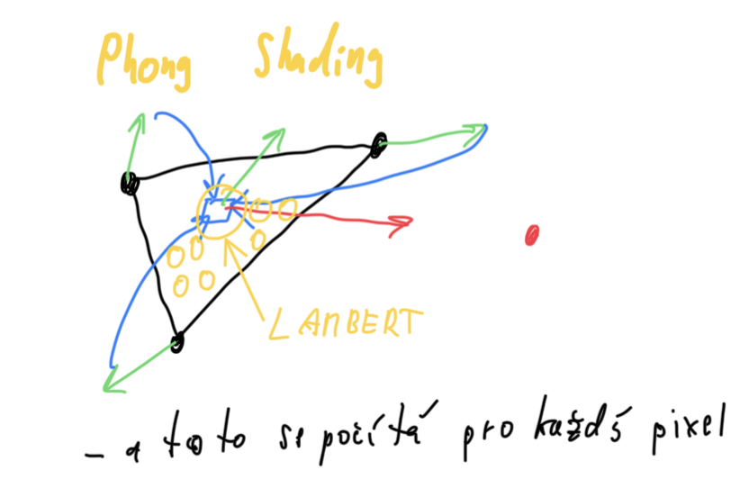

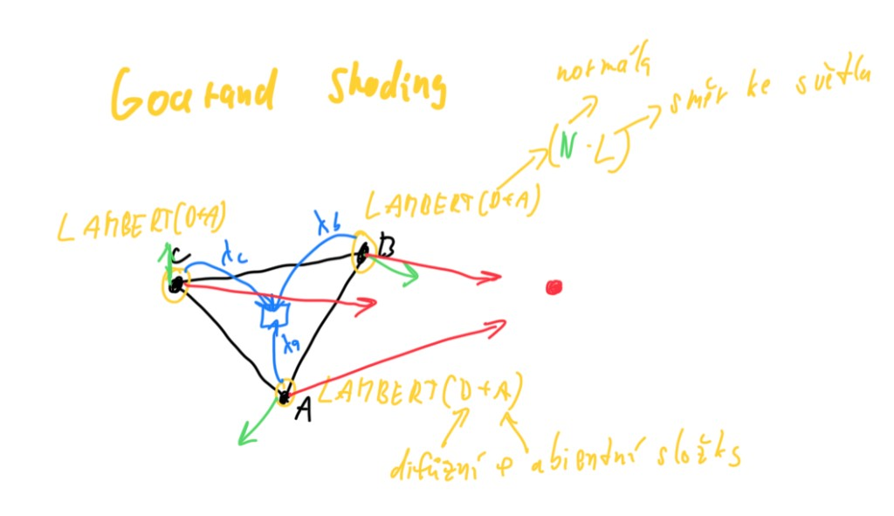

## 4. stínování

Porovnání metod stínování polygonů:

  Metoda                Princip                                                         Kvalita / HW
  --------------------- --------------------------------------------------------------- ------------------------------------------------------
  **Flat shading**      Barva z osvětlení ve středu polygonu, celý polygon konstantní   Nezohledňuje zakřivení, lehké, OpenGL
  **Gouraud shading**   Osvětlení ve vrcholech, interpolace barev po ploše              Zakřivení ano, průměrné normály ve vrcholech, OpenGL
  **Phong shading**     Interpolace normál, osvětlení po pixelech                       Nejkvalitnější, shadery, náročnější

## 5. OpenGL pipeline

**OpenGL pipeline** --- transformace vrcholu z modelového prostoru do obrazovky:

1.  **Model-space** `[x, y, z, 1]`^`T`^ × **Model matrix** (S, T, R --- měřítko, posun, rotace) →
2.  **World-space** `[x′, y′, z′, 1]`^`T`^ × **View / Eye matrix** →
3.  **View-space** `[x″, y″, z″, 1]`^`T`^ × **Projection matrix** →
4.  **Clip-space** `[x‴, y‴, z‴, w‴]`^`T`^ --- ořez: `−w‴ ≤ x‴,y‴,z‴ ≤ +w‴`
5.  **Perspective division** (dělení `w‴`) → **NDC** `[x⁗, y⁗, z⁗, 1]`^`T`^, souřadnice v `[−1, +1]`
6.  **Viewport transform** → **Screen-space** (pixely ve framebufferu)

Po transformaci vrcholů dál v pipeline:

- rasterizace vytvoří fragmenty
- fragment shader určí barvu a texturu
- z-buffer řeší viditelnost

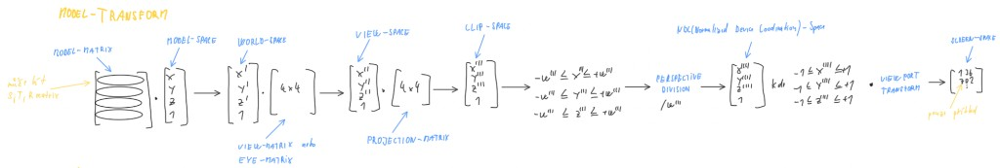

## 6. jak poznat přivrácenou / odvrácenou stranu objektu

Viditelné plochy jsou orientované k pozorovateli --- normála směřuje k pozorovateli.

**Test přivrácené strany:** skalární součin vektoru **pohledu** `V` (od povrchu ke kameře) a **normály** `n` plochy:

- **Kladný výsledek** `V · n > 0` → plocha je **přivrácená** (viditelná z daného směru).
- **Záporný** → odvrácená (zadní strana), lze vynechat (back-face culling).

<!-- -->

- Hrana mezi dvěma viditelnými plochami je potenciálně viditelná.
- Hrana mezi neviditelnými plochami je neviditelná.
- Hrana mezi viditelnou a neviditelnou plochou je obrysová.

## 7. z-buffer

**Z-buffer** --- 2D pole (stejná velikost jako color buffer / framebuffer), ukládá hloubku `z` nejbližšího fragmentu, typicky float. Počítá se v GPU.

1.  O jakou datovou strukturu se jedná? → **2D pole**
2.  Jakou má velikost? → **jako framebuffer** (rozlišení obrazu)
3.  Jaké hodnoty obsahuje? → **Z souřadnice** (hloubka) nejbližších bodů ploch
4.  Kde se používá? → **GPU**, rasterizace
5.  Pro jaké objekty je vhodný? → **netransparentní polygony** (trojúhelníky)
6.  Řeší problém **viditelnosti** --- který pixel se vykreslí, když se plochy překrývají

## 8. řádkové vyplnování

**Řádkové vyplňování** (scan-line fill) --- 4 kroky:

1.  Pro každý řádek oblasti vytvořit seznam souřadnic `x` průsečíků s hranami (vodorovné hrany vynechat).
2.  Seřadit seznam podle `x`.
3.  Vykreslit vodorovné úseky mezi lichým a sudým průsečníkem (1--2, 3--4, ...).
4.  Je-li počet průsečníků lichý, v lokálním extrému vykreslit úsek obou hran.

Varianty: šrafování (přeskakování řádků), gradient (inkrement parametru po řádcích), inverzní řádkové vyplňování.

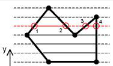

## 9. textury u 3D modelů

**Textura** --- popis detailu povrchu nezávislý na geometrii, vzorek = texel.

**Typy:**

- **Datové** --- uložené v paměti, rychlé, náchylné k aliasu.
- **Procedurální** --- dynamické, parametrické, méně aliasu, pomalejší.

**Informace na textuře:** barva, průhlednost, optické vlastnosti, normála (bump), geometrie (displacement), zrcadlení okolí, osvětlení.

**Mapování na 3D:** inverzní analytické funkce (koule, válec), premietání z obalového tělesa, 3D textury (scale), UV mapování (rozvinutí „kůže").

**Mapování povrchu:**

- **Bump mapping** --- optická změna normály
- **Displacement mapping** --- skutečná změna geometrie
- **Environment mapping** --- odraz okolí
- **Light mapping** --- předpočítané světlo

## 10. pinedův algoritmus

**Pinedův algoritmus** --- vyplňování konvexní oblasti (nejčastěji trojúhelník).

- Oblast = seznam hran dělících rovinu na poloroviny.
- Bod je uvnitř, leží-li na kladné straně **všech** polorovin (hranová funkce ≥ 0).
- **Hranová funkce (edge function)** `E`~`i`~ --- vektorový součin směrového vektoru hrany a vektoru z počátku hrany do bodu `P`.
- Je-li `E`~`i`~`(P) ≥ 0`, bod je uvnitř nebo na hranici.
- Lze optimalizovat inkrementálně po řádcích/sloupcích bez přepočtu pro každý pixel.

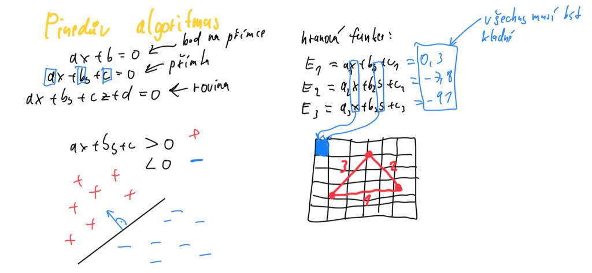

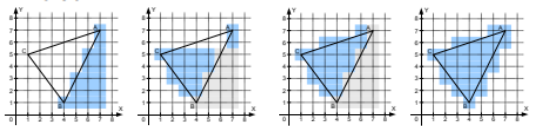

## 11. vertex/fragment shader

**Vertex shader**

- Běží na vertex procesoru, transformuje vrcholy primitiv (model, view, projekce).
- Vstupy: built-in a user attribute/uniform proměnné.
- Výstupy: varying proměnné pro rasterizátor (pozice, normály, UV, ...).

**Fragment shader**

- Operace nad fragmenty (kandidátní pixely), barva, textury, osvětlení ve výsledném renderu.

**Rozdíl:**

- **Vertex shader** --- geometrická transformace do pipeline
- **Fragment shader** --- finální vzhled každého pixelu

## 12. radiozita vs raytracing

Ray-tracing   Radiozita
  ------------------------------ ------------- -------------
  Stíny                          ostré         měkké
  Odrazy okolí na povrchu        ano           ne
  Sekundární osvětlení           ne            ano
  Zdroje světla                  bodové        plošné
  Vhodná reprezentace            CSG           polygonální
  Řeší viditelnost a zobrazení   ano           ne

Ray-tracing je obrazová metoda. Radiozita je komplexní fyzikální metoda globálního osvětlení (měkké stíny, sekundární světlo) a neřeší přímo zobrazení.

## 13. aplikace vytvořené operace v předchozím bodě

Aplikace matic z předchozího tématu na body:

1.  Bod v homogenních souřadnicích `[x, y, w]` nebo `[x, y, z, 1]`.
2.  Násobení maticí transformace (posun, rotace, měřítko, složená matice).
3.  Po perspektivní projekci: **perspektivní dělení** `x' = X/w`, `y' = Y/w` (příp. `z'`).

Afinní transformace zachovává rovnoběžnost přímek, lineární část + translace. Složením matic lze řetězit operace v jednom kroku.

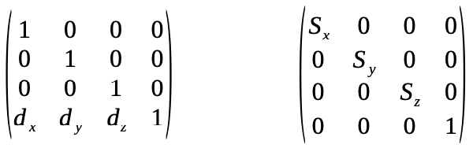

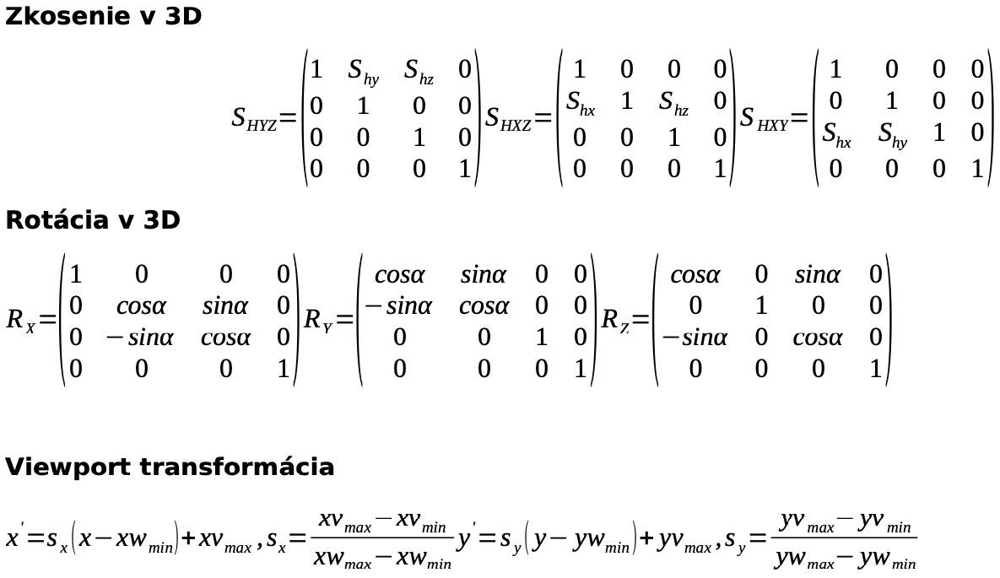

## 14. RGB/CMYK

**RGB** --- aditivní míchání (světlo), základ Red, Green, Blue, max. intenzity = bílá. Monitory, projektory, kamery.

**CMYK** --- subtraktivní míchání (pigment), Cyan, Magenta, Yellow, Black (Key), max. = černá. Tisk.

**HSV** --- **H** odstín, **S** sytost, **V** světlost. Uživatelsky orientovaný model (barevná kolečka v editorech). Při úbytku **V** klesá i sytost, barva tmavne k černé.

<figure>
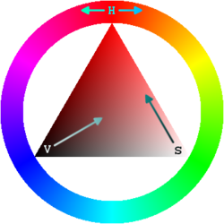
<figcaption>HSV: H po obvodu, S od bílé ke syté barvě, V od černé ke světlé</figcaption>
</figure>

**HSL** --- stejné **H** a **S**, místo světlosti **L** jas (lightness). CSS, návrhové nástroje. Při **L** 0 % nebo 100 % klesá sytost na nulu (černá / bílá).

<figure>
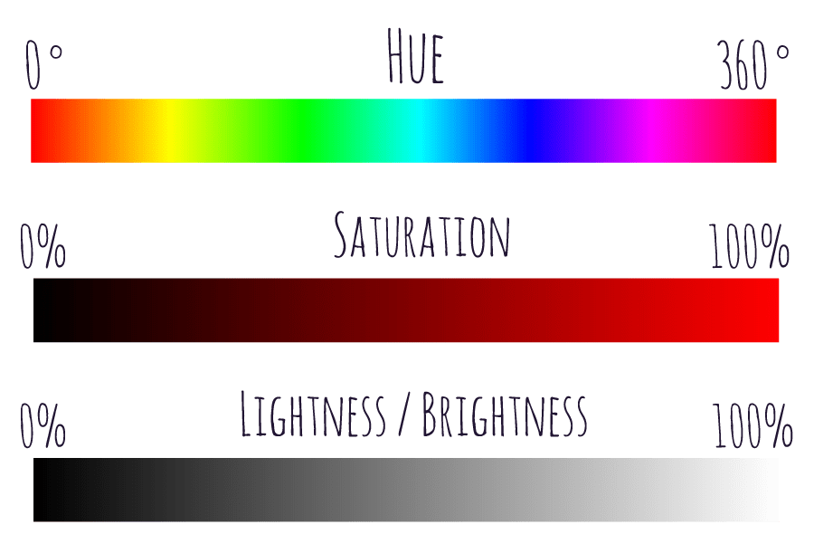
<figcaption>HSL: H (0°–360°), S (0–100 %), L jas / světlost (0–100 %)</figcaption>
</figure>

Převod do šedotónu: vážený průměr kanálů, prakticky 256 úrovní.

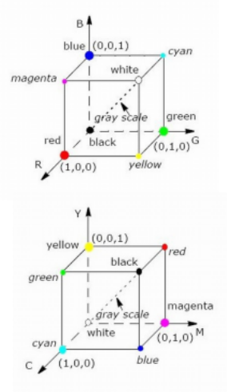

## 15. DDA s fixed point aritmetikou

**DDA s fixed-point aritmetikou** --- rasterizace úsečky bez floatů, přírůstek `k` ve fixed-point reprezentaci.

    #define FRAC_BITS 8

    LineDDAFixed(int x1, int y1, int x2, int y2) {
       int k = (y2 - y1) << FRAC_BITS / (x2 - x1);
       int y = y1 << FRAC_BITS;

       for (int x = x1; x <= x2; x++) {
           draw_pixel(x, y >> FRAC_BITS);
           y += k;
       }
    }

Oproti float DDA: rychlejší na HW bez FPU, stejný princip --- po `x` inkrementovat `y` o směrnici.

## 16. aditivni / substraktivni model

**Aditivní model (RGB)** --- sčítání světelných složek, více světla = světlejší, bílá = složení max. R+G+B.

**Subtraktivní model (CMYK)** --- odčítání od bílého papíru pigmenty, více pigmentu = tmavší, černá = plné CMY + K.

RGB pro emisivní zařízení, CMYK pro tisk --- fyzikálně odpovídají složení vs. filtrace světla.

## 17. pseudokod vykresleni krivky

Pseudokód rasterizace úsečky (DDA) --- první kvadrant, rostoucí úsečka:

    LineDDA(int x1, int y1, int x2, int y2) {
       double k = (y2 - y1) / (x2 - x1);
       double y = y1;

       for (int x = x1; x <= x2; x++) {
           draw_pixel(x, round(y));
           y += k;
       }
    }

Pro křivky (De Casteljau): opakovaně dělit řídicí polygon v poměru `t` a `1−t`, spojovat body úsečkami pro různá `t`.

## 18. alias

**Aliasing** --- nežádoucí jev při nízkofrekvenčním vzorkování vysokofrekvenčního signálu (zubaté hrany, poruchy textur).

**Příčiny:** příliš malá vzorkovací frekvence, příliš pravidelné nebo přesné vzorkování.

**Shannonův vzorkovací teorém:** přesná rekonstrukce je možná, pokud je vzorkovací frekvence ≥ 2× maximální frekvence signálu.

**Řešení:**

- Zvýšení rozlišení (náročné).
- Předfiltrování vstupu / supersampling (více vzorků na pixel, konvoluce).
- Přefiltrování výstupu (postprocess, ztráta detailů).
- **Multisampling** --- adaptivní supersampling hlavně u hran.

## 19. B-rep

**B-rep (Boundary representation)** --- objekt popsaný povrchem (hranice), bez uložené vnitřní struktury.

- Skládá se z **vrcholů**, **hran** (úsečky, křivky) a **stěn** (polygony).
- **Drátový model** --- málo informací, rychlý náhled.
- **Polygonální model** --- jednoznačný, méně přesný, HW podpora.
- Požadavky na model: obecnost, úplnost, jednoznačnost, přesnost, regulérnost, konzistence operací, kompaktnost.
- **Manifold** --- každá hrana sdílena max. dvěma stěnami (vyrobitelný objekt).

## 20. MIP mapping

**MIP mapping** --- řešení aliasu textur při zmenšení podle vzdálenosti od kamery.

- Více úrovní (mipmap) stejné textury: každá další má poloviční rozměr (32→16→8→...→1).
- Uloženo v jedné větší 2D struktuře (např. 2× rozlišení původní textury).
- Mohou být předgenerované na disku, při zmenšení vyhlazovací filtr.
- Zrychlení texturování malých objektů, lepší vizuální kvalita.

Perspektivní zkreslení UV: řešení dělením polygonů na menší části.

## 21. Brassenhamův algoritmus

**Bresenhamův (midpoint) algoritmus** --- celočíselná rasterizace úsečky.

    LineBres(int x1, int y1, int x2, int y2) {
       int dx = x2 - x1, dy = y2 - y1;
       int P = 2*dy - dx;
       int P1 = 2*dy, P2 = P1 - 2*dx;
       int y = y1;

       for (int x = x1; x <= x2; x++) {
           draw_pixel(x, y);
           if (P >= 0) { P += P2; y++; }
           else          P += P1;
       }
    }

Rozhodování o kroku v `y` pomocí prediktoru `P`, jen sčítání a porovnání --- efektivnější než DDA s float.

## 22. parametrický/směrnicový tvar přímky

**Parametrický tvar přímky** (s parametrem `t`):

`P(t) = P`~`1`~` + t · (P`~`2`~` − P`~`1`~`)`, `t ∈ [0, 1]`

Směrový vektor `u = (x`~`2`~`−x`~`1`~`, y`~`2`~`−y`~`1`~`)`.

**Směrnicový tvar** (funkce `y = f(x)`):

`y = q + k·x`, kde `k = dy/dx` je směrnice, `q` offset na ose Y.

Směrnicový tvar nejde pro svislé přímky, parametrický je obecnější.

## 23. algoritmus De Casteljau

**Algoritmus de Casteljau** --- rekurentní vykreslení Bézierových křivek.

1.  Řídicí body polygonu, pro dané `t` dělit každou úsečku v poměru `t : (1−t)`.
2.  Opakovat na novém polygonu, dokud nezůstane jeden bod --- bod na křivce.
3.  Pro různá `t` s krokem spojovat body úsečkami.

U kubik: „divide and conquer" --- rekurzivní dělení na dvě podkřivky (`t = 0.5`), ukončit, když je křivka dostatečně rovná (vzdálenost \< úhlopříčka pixelu).

## 24. ořez Weiler-Artheton

**Weiler--Atherton** --- ořez polygonu oknem (obecné polygony, i s otvory).

Seznamy:

- `P` --- vrcholy a průsečíky na polygonu
- `W` --- na okně
- `I` --- vstupní průsečíky
- `O` --- výstupní průsečíky
- `C` --- ořez uvnitř okna
- `R` --- odřezky venku

1.  Průsečíky (např. Liang--Barsky).
2.  Polygon celý uvnitř → do `C`.
3.  Start v `P` na prvním vrcholu z `I`, střídat pohyb po `P` / `W` podle typu průsečíku.
4.  Odřezky mimo okno → `R`, analogicky od prvního `O`.

## 25. textury u trojuhelniku

**Texturování trojúhelníku** --- souřadnice textury v jednotlivých vrcholech, interpolace po ploše.

Příklad z guide (barva / textura v těžišti a na hranách):

- `T(r,g,b) = ⅓(P`~`1`~`+P`~`2`~`+P`~`3`~`)` v těžišti.
- `C`~`13`~`(r,g,b) = ½(P`~`1`~`+P`~`3`~`)` na hraně.

Obecně: `(u,v)` ve vrcholech → lineární interpolace `u,v` (a případně hloubka `z`) uvnitř polygonu, vzorkování texelu. U perspektivy je vhodné korektní perspektivní interpolace nebo dělení na menší trojúhelníky.

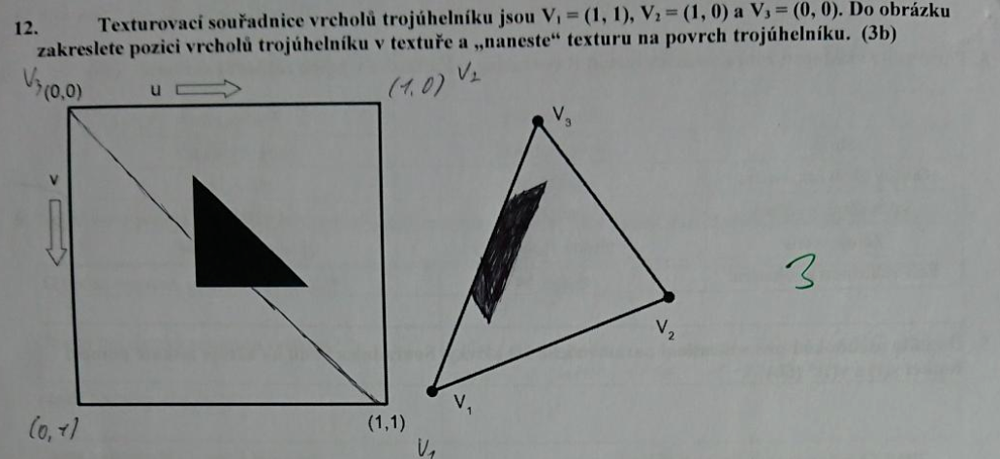

## 26. texturovací souřadnice

**Texturovací souřadnice (u, v)**

- Zadávají se **ručně nebo automaticky** u vrcholů sítě --- dva floaty `u, v`.
- Typicky **0--1** (normalizované) --- pozice na 2D textuře.
- Mezi vrcholy se **lineárně interpolují** po polygonech.
- Definiční obor textury může být i **3D prostorová textura** `[x,y,z]`, normála, vektor odrazu (environment mapping), předpočítaná light mapa.

## 27. Shannonův vzorkovací teorém

**Shannonův vzorkovací teorém:** přesná rekonstrukce spojitého, frekvenčně omezeného signálu z diskrétního vzorku je možná tehdy, pokud byla vzorkovací frekvence **alespoň dvojnásobkem** maximální frekvence signálu (Nyquist: `f`~`s`~` ≥ 2·f`~`max`~).

Porušení → aliasing. Řešení: vyšší vzorkování, předfiltrování (supersampling), vyhlazení výstupu.

## 28. multisampling/supersapling

**Supersampling** --- předfiltrování, pixel rozdělen na více vzorků, výsledná barva = složení (konvoluční filtr), vyhlazí hrany i textury, vysoká cena.

**Multisampling** --- adaptivní supersampling, hustší vzorkování u hran a gradientů, méně u ploch, výrazné vyhlazení hran, menší pokles výkonu než plný supersampling.

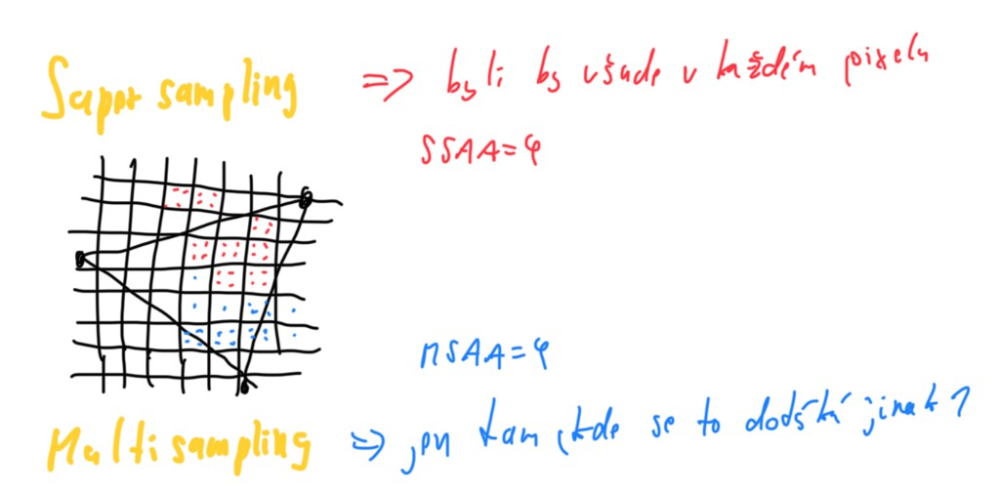

## 29. grafický kontext

**Grafický kontext** --- datová struktura pro kreslení na různá výstupní zařízení (display, bitmapa, PDF, soubor).

**Skládá se z:**

- Parametrů výstupního zařízení (formát obrazu).
- Šířky a výšky kreslící plochy (včetně ořezu).
- Transformace výstupu (device-independent kreslení).

Cíl: jednotné API pro Window, Printer, Drawing, PDF atd.

## 30. halftoning/dithering

**Dithering** --- nahrazení stupňů šedi černobílými tečkami, zachová rozměr, výstup na obrazovku.

- **Prahování** --- podle prahu `T`, jednoduché, špatné u jemných přechodů.
- **Náhodné rozptýlení** --- rychlé, zachová jasové poměry.
- **Distribuce chyby** (Floyd--Steinberg, Bayer, ...) --- chyba k sousedům.
- **Maticové rozptýlení** --- porovnání s rozptylovací maticí.

**Halftoning** --- každý pixel nahrazen vzorem černobílých bodů dané hodnoty, **zvětšuje** rozměr obrazu, výstup do tiskárny.

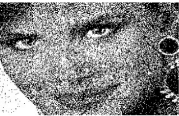

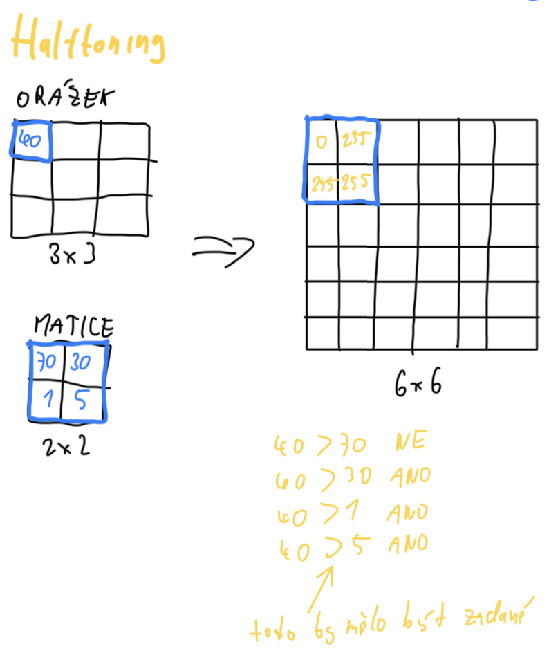

## 31. perspektivni vs paralelni projekce

**Perspektivní projekce**

- Středová --- paprsky se sbíhají v jednom bodě (kamera).
- Nezachovává rovnoběžnost hran.
- Vzdálenost od středu ovlivňuje velikost průmětu.

**Paralelní (ortogonální) projekce**

- Rovnoběžné paprsky (často kolmé).
- Zachovává rovnoběžnost.
- Vzdálenost obvykle neovlivňuje velikost průmětu.

Ortogonální: kvádr, perspektivní: jehlan.

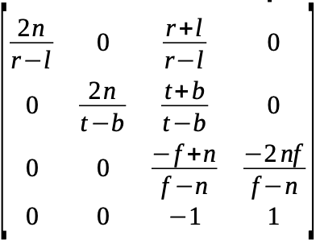

## 32. barycentricke souradnice

**Barycentrické souřadnice** --- váhy `λ`~`1`~`, λ`~`2`~`, λ`~`3`~ vůči vrcholům trojúhelníku:

`P = λ`~`1`~`P`~`1`~` + λ`~`2`~`P`~`2`~` + λ`~`3`~`P`~`3`~, kde `λ`~`1`~`+λ`~`2`~`+λ`~`3`~` = 1`.

Bod je uvnitř, jsou-li všechny `λ`~`i`~` ≥ 0`. Výpočet z plošných nebo vektorových veličin (např. plochy dílčích trojúhelníků). Použití: interpolace barev, textur, normál uvnitř trojúhelníku.

## 33. lambertuv osvetlovaci model

**Lambertův (difúzní) osvětlovací model** --- intenzita odraženého světla úměrná `cos θ`, kde `θ` je úhel mezi směrem světla `L` a normálou `n` (často `I ∝ max(0, L·n)`).

Na diagramu označte: zdroj světla, bod na povrchu, normálu `n`, směr k pozorovateli `V`, úhel `θ`. Difúzní odraz jde do všech směrů --- pozorovatel vidí stejně (matný povrch).

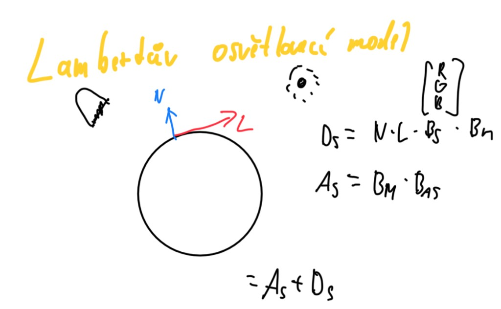

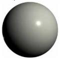

## 34. rovnice křivky

**Rovnice křivky** --- polynomiální tvar, např. spline segmenty:

`Q(t) = a t³ + b t² + c t + d` (kubika), koeficienty z okrajových podmínek (body, tečny).

**Typy:** interpolační (prochází body), aproximační (řídicí body), racionální (váhy --- invariantní k perspektivě), neracionální.

**Fergusonova kubika:** 2 koncové body + 2 tečny, spojení C⁰/C¹. **Bézier:** Bernsteinovy polynomy, konvexní obal řídicích bodů.

## 35. paramertický tvar křivky

**Parametrický tvar křivky** `Q(t)`:

`Q(t) = (x(t), y(t))` nebo `Q(t) = P`~`1`~` + t(P`~`2`~` − P`~`1`~`)`, `t ∈ [0, 1]`.

Pro úsečku: `x(t) = x`~`1`~` + t(x`~`2`~`−x`~`1`~`)`, `y(t) = y`~`1`~` + t(y`~`2`~`−y`~`1`~`)`. U Bézierovy křivky stupně `n` je `n+1` řídicích bodů, `t` parametrizuje průběh po křivce.
